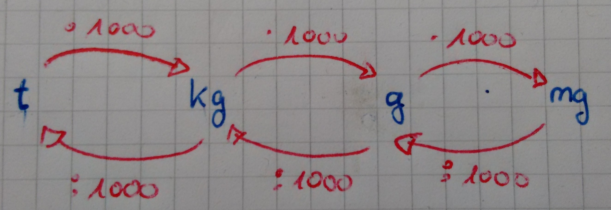

<!--
author: Susanne Suckfüll
email: su-aes@masannek.de
language: de
narrator: German Female
script: url.js

View this file on https://liascript.github.io/course/?https://raw.githubusercontent.com/SUC-AES/Mathematik-5/master/2_Massen_1.md
-->

# Massen - Jahrgang 5

Diese Seite wurde im Zuge der Schulschließung wegen des Corona-Virus für die Schülerinnen und Schüler des fünften Jahrgang der Albert-Einstein-Schule entwickelt.

Sie lehnt sich an unser schuleigenes Arbeitsheft "Kitty" für Größen an. Mit dieser Seite können unsere Schülerinnen und Schüler in der Zeit bis zu den Osterferien das Thema **Massen** bearbeiten.

Neben der Aufteilung des Themas in kleinere Abschnitt mit Aufgabenblöcken für vier Tage in der Woche, können hier auch die Rechenwegen zu den Aufgaben im Kitty-Heft eingesehen werden.

### Liebe Eltern

Zusätzlich zu den Mails erhalten Sie den Arbeitsauftrag für die nächsten drei Wochen auch auf diesem Weg. Die Kinder haben noch keine Ferien und sollen in den einzelnen Fächern an den Themen weiterarbeiten.

In Mathematik sollen sie zuerst den Wochenplan "Geldwerte" beenden. Für die darauffolgende Tage erhalten die Kinder einen Arbeitsauftrag zum Thema "Massen". Ich werde es in kleinere Teile aufteilen, sodass die Kinder jeden Tag der Woche daran arbeiten können. Natürlich können sich die Kinder die Zeit anders einteilen. Sie sollten dennoch darauf achten, dass sie für einen größeren Lernerfolg jede Woche in Mathematik Aufgaben lösen. Inwieweit am Ende eine Lernkontrolle in Form eines Testes oder eine andere Notengebung erfolgt, steht noch nicht fest. Dennoch sollten die Kinder mit einem kleinen Test rechnen.

Auf ein gutes Gelingen!

*Susanne Suckfüll*

### Liebe Schülerinnen und Schüler des fünften Jahrgangs

Leider werden wir uns erst nach den Osterferien wiedersehen. Das auf Grund einer Pandemie die Schulen geschlossen bleiben, gab es bisher nicht in diesem Ausmaß. Allerdings heißt das für euch nicht, dass ihr jetzt fünf Wochen Osterferien habt. Ihr sollt trotzdem in den Themen der unterschiedlichen Fächer weiterarbeiten.

Es ist bestimmt ungewohnt für euch, morgens mit dem Wecker aufzustehen und dann nicht in die Schule zu geben. Dennoch ist es wichtig, dass ihr eine gewisse Routine für zu Hause entwickelt, damit ihr motiviert an die Schularbeiten geht. Stellt weiterhin den Wecker, auch wenn es etwas später ist, frühstückt und macht euch dann an die Schulaufgaben. Wie in der Schule selber, könnt ihr hier auch kleine Pausen einlegen, am besten aber ohne Bildschirme jeder Arte.

In Mathematik bearbeitet ihr bitte bis Mittwoch den Wochenplan zum Thema "Geldwerte". Die Abgabe erfolgt dann nach den Osterferien. Zusätzlich sollt ihr in der Zeit bis zu den Osterferien das Thema "Massen" bearbeiten. Die Mathematiklehrerinnen der 5. Klasse arbeiten gemeinsam, um euch die Lösungen des Kitty-Heftes zur Verfügung zu stellen. Auch möchten wir euch diese Webseite hier zur Verfügung stellen, auf der ihr weitere Hilfen zur Bearbeitung des Themas erhaltet. Nutzt vorhandene Musterlösungen und Rechenwege, um eure Aufgaben zu vergleichen. Wir sind gerade am Aufbau der Webseite und werden sie regelmäßig erweitern.

Ihr erhaltet für jeden Tag der Woche ein kleines Paket an Aufgaben. Ihr könnt sie euch natürlich auch anders einteilen, solltet sie aber immer in der Woche machen, die dafür vorgesehen war. Richtet euch auch darauf ein, dass ihr, wenn es eure Lehrerin darüber informiert hat, einen kleinen Test am Ende des Themas Massen schreibt. Wie genau das abläuft, erfahrt ihr nach den Ferien.

Mit dieser Seite und dem Kitty-Heft habt ihr dann die Möglichkeit, das Thema **Massen** zu bearbeiten.

Wenn ihr Fragen habt, könnt ihr auch eine Mail an eure Mathematik-Lehrerin schreiben. Wir hoffen, dass die Schul-Server bald wieder so stabil laufen, dass alle Mails ankommen.

Liebe Grüße, bleibt alle gesund und verhaltet euch so, dass es auch eure Mitmenschen bleiben!

Für die Mathematik-Lehrerinnen *Frau Suckfüll*

## Täglicher Term

Beginne jeden Tag mit der Berechnung eines Terms. Gib das Ergebnis in das Feld unter dem Term an und vergleiche dann dein Rechenweg mit der angegebenen Musterlösung.

Leuchtet die Check-Box grün auf, hast du das korrekte Ergebnis eingegeben, bei einem falschen Ergebnis leuchtet sie rot auf.

Teste die korrekte Lösung: Das Ergebnis von $3+4$ ist

[[7]]

Und nun gib ein falsches Ergebnis für $3+4$ ein:

[[7]]

Über das eingekreiste i erhältst du das korrekte Ergebnis. Der gelbe Ausdruck "Resolved" gibt an, dass du das Ergebnis gesagt bekommen hast. Dies geschieht immer bei nicht ausgefüllten bzw. falschen Ergebnissen.

### Woche 1

**Tag 1**

  Berechne den Term und gib das Ergebnis an:
  $ ( 16+ 12 \cdot 4 ) : (3 \cdot 13 - 31  )$

  [[8]]
  ***********************************************************************

  Vergleiche deinen Rechenweg mit der Musterlösung hier und berichtige gegebenenfalls deine Fehler:
  $$
\begin{aligned}
\quad & ( 16+ 12 \cdot 4 )  : (3 \cdot 13 - 31  ) \\
= & (16+48) : (39 -31) \\
= & 64 : 8 \\
= & 8
\end{aligned}
$$

  ***********************************************************************

  **Tag 2**

    Berechne den Term und gib das Ergebnis an:
    $ [100-(42-23) \cdot 5] \cdot (100-87) $

    [[65]]
    ***********************************************************************

    Vergleiche deinen Rechenweg mit der Musterlösung hier und berichtige gegebenenfalls deine Fehler:
    $$
    \begin{aligned}
    \quad &[100-(42-23) \cdot 5] \cdot (100-87) \\
    = & [100 - 19 \cdot 5] \cdot 13  \\
    = & [100 - 95] \cdot 13  \\
    = & 5 \cdot 13 \\
    = & 65
    \end{aligned}
    $$

    ***********************************************************************

## 1. Maßeinheiten

Beginne in deinem Heft eine neue Seite mit den beiden Überschriften, die du wie immer auch in dein Inhaltsverzeichnis schreiben sollst.

> **~~3. Größen: Massen ~~**

> **~~3.1 Maßeinheiten~~**

Wir rechnen insgesamt mit vier verschiedenen Maßeinheiten: Kilogramm, Gramm, Milligramm und Tonnen.

Entscheide, wie die Einheiten der Größe nach geordnet werden:

[[größte] (zweitgrößte) (drittgrößte) [kleinste ]]
[ [ ]           [X]          [ ]           [ ]    ] Kilogramm
[   [ ]          [ ]          [X]          [ ]    ] Gramm
[   [ ]          [ ]          [ ]          [X]    ] Milligramm
[   [X]          [ ]           [ ]          [ ]  ] Tonne
***********************************************************************

Die größte Einheit ist die Tonne. Danach folgen, so wie du es von den Längen kennst, die Kilogramm, Gramm und Milligramm.

***********************************************************************

###Pfeilbild

Du sollst nun in dein Heft das Pfeilbild zum Umrechnen zwischen den Einheiten übernehmen. Wenn du möchtest, kannst du dir dazu erst dieses [Video von Lehrer Schmidt](https://www.youtube.com/watch?v=fxD5937olmU) anschauen. Lehrer Schmidt erklärt dir auch gleich einfache Umrechnungen, wobei er aber schon mit Kommas arbeitet.

!?[movie](https://www.youtube.com/watch?v=fxD5937olmU)

Übernimm nun das Pfeilbild in dein Matheheft.

> 

**Übersicht über die Massen**

Übertrage die untere Aufgabe in dein Matheheft und fülle dabei auch die Lücken aus. Wenn du dies getan hast, schreibe in das untere Feld "fertig", um die Musterlösung zu erhalten.

> $$
  \begin{aligned}
    1 t  & = ...................... & kg & = ...................... & g & = ...................... mg \\
    1 kg & = ...................... & g & = ......................  & mg & \\
    1g & = ...................... & mg & & & \\
  \end{aligned}
$$

[[fertig]]
***********************************************************************

Vergeiche deine Ergebnisse und berichtige eventuelle Fehler.

Achte darauf die Zahlen in Dreierpäckchen zusammenzufassen. Du kannst sie dann viel besser lesen.

$$
  \begin{aligned}
    1 t  & = & 1.000 & kg & = &  1.000.000 & g & = 1.000.000.000 mg \\
    1 kg & = & 1.000 & g & = &  1.000.000  & mg & \\
    1g & = & 1.000 & mg & & & & \\
  \end{aligned}
$$

***********************************************************************

###Aussagen zu den einfachen Umformungen

{{0-1}}
**********************
*Diese Seite ist eine freiwillige Aufgabe. Ich würde mich aber freuen, wenn du sie machst und mir eine kurze Rückmeldung gibst, ob sie dir geholfen haben. Falls du sie nicht machen möchtest, dann ...*

 **... löse direkt im Kittyheft auf der Seite 13 den Kasten und die Nummer 1.**

Versuche es zuerst ohne das Pfeilbild. Wenn du dir nicht sicher bist, kannst du es dir anschauen.

Bei mehreren richtigen Antworten musst du alle markieren.

**********************

{{1-2}}
**********************
**Aussage 1**

    Die Umrechnungszahl zwischen benachbarten Massen ist immer ...

    [( )] 10
    [( )] 100
    [(X)] 1.000
    [( )] 10.000
**********************

{{2-3}}
***************************
  **Aussage 2**

    Um von Tonnen in Gramm umzurechnen, muss ich ...

    [( )] zwei Nullen ergänzen.
    [( )] drei Nullen ergänzen.
    [(X)] sechs Nullen ergänzen.
    [( )] keines der genannten.
***************************

{{3-4}}
**********************
  **Aussage 3**

    Um von Milligramm in Gramm umzurechnen, muss ich ...

    [( )] eine Null streichen.
    [( )] eine Null ergänzen.
    [(X)] drei Nullen streichen.
    [( )] drei Nullen ergänzen.
    [( )] keines der genannten.
    **********************

{{4-5}}
**********************
  **Aussage 4**

    Wenn ich sechs Nullen ergänze, muss ich die Masse ...

    [( )] in der nächstkleineren Einheit angeben.
    [(X)] in der übernächsten kleineren Einheit angeben.
    [( )] in der nächstgrößeren Einheit angeben.
    [( )] in der übernächsten größeren Einheit angeben.
    [( )] keines der genannten.
    **********************

{{5-6}}
**********************
  **Aussage 5**

    Wenn ich eine Nullen streiche, muss ich die Masse ...

    [( )] in der nächstkleineren Einheit angeben.
    [( )] in der übernächsten kleineren Einheit angeben.
    [( )] in der nächstgrößeren Einheit angeben.
    [( )] in der übernächsten größeren Einheit angeben.
    [(X)] keines der genannten.
    **********************

{{6-7}}
**********************
  **Aussage 6**

    Die Masse 120.000 kg kann ich auch als ... schreiben.

    [[ ]] 12 t
    [[X]] 120 t
    [[ ]] 1.200.000.000 g
    [[X]] 120000000000 mg - jetzt wären Dreierpäckchen gut
    [[ ]] keines der genannten.

**Jetzt löse im Kittyheft auf der Seite 13 den Kasten und die Nummer 1.**

**********************

###Musterlösung Kitty S. 13 Nr. 1

  Wenn du den Kasten und die Aufgabe gelöst hast, vergleiche hier deine Ergebnisse und berichtige deine Fehler.

## 2. Umformen

  Schreibe die Überschrift in dein Heft

>  **~~3.2 Umformen~~**

  Du kennst die Einheitentabelle bereits von den Längen.

  Für die Umrechnungszahl 1.000 hat jede Masseneinheit drei Spalten.

  **Löse nun im Kittyheft auf Seite 13 die Aufgabe 2**

  Wenn du damit fertig bist, gehe zur [nächsten Seite](#11)

###Musterlösung Kitty S. 13 Nr.2

  Wenn du die Aufgabe gelöst hast, vergleiche hier deine Ergebnisse und berichtige deine Fehler.

>  **Damit hast du den Arbeitsauftrag für Woche 1 Tag 1 geschafft. Bis morgen!!**

###Umformungen mit Kommas

Vervollständige den Merksatz "Das Komma steht immer ...".

[[hinter dem Einer der angegebenen Einheit.]]
***********************************************************************

Schreibe den vollständigen Merksatz rot in dein Heft.

> Das Komma steht immer hinter dem Einer der angegebenen Einheit.

***********************************************************************

  **Bearbeite nun im Kittyheft auf der Seite 14 die Nummern 1 und 2.**

###Aussagen zum Umformungen

Bei mehreren richtigen Antworten musst du alle markieren.

  **Aussage 1**

    Die Umrechnungszahl zwischen benachbarten Massen ist immer ...

    [( )] 10
    [( )] 100
    [(X)] 1.000
    [( )] 10.000

  **Aussage 2**

    Um von Tonnen in Gramm umzurechnen, muss ich ...

    [( )] zwei Nullen ergänzen.
    [( )] drei Nullen ergänzen.
    [(X)] sechs Nullen ergänzen.
    [( )] keines der genannten.

##Haftung für Links

Wir sind für den Inhalt von Webseiten, die über einen Hyperlink erreicht werden, nicht verantwortlich. Für den Inhalt der verlinkten Seiten sind ausschließlich deren Betreiber verantwortlich. Wir machen uns die Inhalte dieser Internetseiten ausdrücklich nicht zu eigen und können deshalb für die inhaltliche Korrektheit, Vollständigkeit und Verfügbarkeit keine Gewähr leisten. Wir haben bei der erstmaligen Verknüpfung zwar den fremden Inhalt daraufhin überprüft, ob durch ihn eine mögliche zivilrechtliche oder strafrechtliche Verantwortlichkeit ausgelöst wird. Wir sind aber nicht dazu verpflichtet, die Inhalte, auf die wir unserem Angebot verweisen, ständig auf Veränderungen zu überprüfen, die eine Verantwortlichkeit neu begründen könnten. Erst wenn wir feststellen oder von anderen darauf hingewiesen werden, dass ein konkretes Angebot, zu dem wir einen Link bereitgestellt haben, eine zivil- oder strafrechtliche Verantwortlichkeit auslöst, werden wir den Verweis auf dieses Angebot aufheben, soweit uns dies technisch möglich und zumutbar ist.
