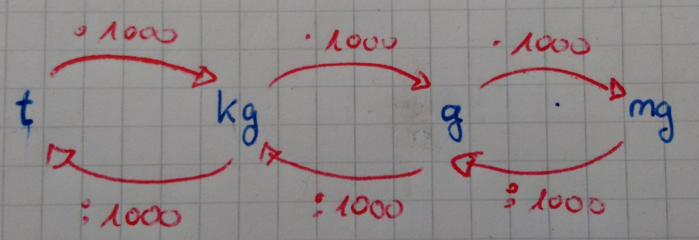
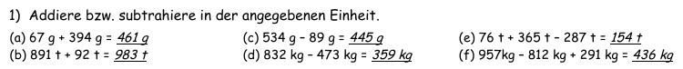

<!--
author: Susanne Suckfüll
email: su-aes@masannek.de
language: de
narrator: German Female
script: url.js

View this file on https://liascript.github.io/course/?https://raw.githubusercontent.com/SUC-AES/Mathematik-5/master/2_Massen_1.md
-->

# Massen - Jahrgang 5

Diese Seite wurde im Zuge der Schulschließung wegen des Corona-Virus für die Schülerinnen und Schüler des fünften Jahrgang der Albert-Einstein-Schule entwickelt.

Sie lehnt sich an unser schuleigenes Arbeitsheft "Kitty" für Größen an. Mit dieser Seite können unsere Schülerinnen und Schüler in der Zeit bis zu den Osterferien das Thema **Massen** bearbeiten.

Neben der Aufteilung des Themas in kleinere Abschnitt mit Aufgabenblöcken für vier Tage in der Woche, können hier auch die Rechenwege zu den Aufgaben im Kitty-Heft eingesehen werden.

### Liebe Eltern

Zusätzlich zu den Mails erhalten Sie den Arbeitsauftrag für die nächsten drei Wochen auch auf diesem Weg. Die Kinder haben noch keine Ferien und sollen in den einzelnen Fächern an den Themen weiterarbeiten.

In Mathematik sollen sie zuerst den Wochenplan "Geldwerte" beenden. Für die darauffolgende Tage erhalten die Kinder einen Arbeitsauftrag zum Thema "Massen". Ich werde es in kleinere Teile aufteilen, sodass die Kinder jeden Tag der Woche daran arbeiten können. Natürlich können sich die Kinder die Zeit anders einteilen. Sie sollten dennoch darauf achten, dass sie für einen größeren Lernerfolg jede Woche in Mathematik Aufgaben lösen. Inwieweit am Ende eine Lernkontrolle in Form eines Testes oder eine andere Notengebung erfolgt, steht noch nicht fest. Dennoch sollten die Kinder mit einem kleinen Test rechnen.

Auf ein gutes Gelingen!

*Susanne Suckfüll*

### Liebe Schülerinnen und Schüler des fünften Jahrgangs

Leider werden wir uns erst nach den Osterferien wiedersehen. Das auf Grund einer Pandemie die Schulen geschlossen bleiben, gab es bisher nicht in diesem Ausmaß. Allerdings heißt das für euch nicht, dass ihr jetzt fünf Wochen Osterferien habt. Ihr sollt trotzdem in den Themen der unterschiedlichen Fächer weiterarbeiten.

Es ist bestimmt ungewohnt für euch, morgens mit dem Wecker aufzustehen und dann nicht in die Schule zu geben. Dennoch ist es wichtig, dass ihr eine gewisse Routine für zu Hause entwickelt, damit ihr motiviert an die Schularbeiten geht. Stellt weiterhin den Wecker, auch wenn es etwas später ist, frühstückt und macht euch dann an die Schulaufgaben. Wie in der Schule selber, könnt ihr hier auch kleine Pausen einlegen, am besten aber ohne Bildschirme jeder Arte.

In Mathematik bearbeitet ihr bitte bis Mittwoch den Wochenplan zum Thema "Geldwerte". Die Abgabe erfolgt dann nach den Osterferien. Zusätzlich sollt ihr in der Zeit bis zu den Osterferien das Thema "Massen" bearbeiten. Die Mathematiklehrerinnen der 5. Klasse arbeiten gemeinsam, um euch die Lösungen des Kitty-Heftes zur Verfügung zu stellen. Auch möchten wir euch diese Webseite hier zur Verfügung stellen, auf der ihr weitere Hilfen zur Bearbeitung des Themas erhaltet. Nutzt vorhandene Musterlösungen und Rechenwege, um eure Aufgaben zu vergleichen. Wir sind gerade am Aufbau der Webseite und werden sie regelmäßig erweitern.

Ihr erhaltet für jeden Tag der Woche ein kleines Paket an Aufgaben. Ihr könnt sie euch natürlich auch anders einteilen, solltet sie aber immer in der Woche machen, die dafür vorgesehen war. Richtet euch auch darauf ein, dass ihr, wenn es eure Lehrerin darüber informiert hat, einen kleinen Test am Ende des Themas Massen schreibt. Wie genau das abläuft, erfahrt ihr nach den Ferien.

Mit dieser Seite und dem Kitty-Heft habt ihr dann die Möglichkeit, das Thema **Massen** zu bearbeiten.

Wenn ihr Fragen habt, könnt ihr auch eine Mail an eure Mathematik-Lehrerin schreiben. Wir hoffen, dass die Schul-Server bald wieder so stabil laufen, dass alle Mails ankommen.

Liebe Grüße, bleibt alle gesund und verhaltet euch so, dass es auch eure Mitmenschen bleiben!

Für die Mathematik-Lehrerinnen *Frau Suckfüll*

## Täglicher Term

Beginne jeden Tag mit der Berechnung eines Terms. Gib das Ergebnis in das Feld unter dem Term an und vergleiche dann deinen Rechenweg mit der angegebenen Musterlösung.

Leuchtet die Check-Box grün auf, hast du das korrekte Ergebnis eingegeben, bei einem falschen Ergebnis leuchtet sie rot auf.

Teste die korrekte Lösung: Das Ergebnis von $3+4$ ist

[[7]]

Und nun gib ein falsches Ergebnis für $3+4$ ein:

[[7]]

Durch das Anklicken des eingekreisten i erhältst du das korrekte Ergebnis. Der gelbe Ausdruck "Resolved" gibt an, dass du das Ergebnis gesagt bekommen hast. Dies geschieht immer bei nicht ausgefüllten bzw. falschen Ergebnissen.

### Woche 1

**Tag 1 - Donnerstag**

  Berechne den Term und gib das Ergebnis an:
  $ ( 16+ 12 \cdot 4 ) : (3 \cdot 13 - 31  )$

  [[8]]
  ***********************************************************************

  Vergleiche deinen Rechenweg mit der Musterlösung hier und berichtige gegebenenfalls deine Fehler:
  $$
\begin{aligned}
\quad & ( 16+ 12 \cdot 4 )  : (3 \cdot 13 - 31  ) \\
= & (16+48) : (39 -31) \\
= & 64 : 8 \\
= & 8
\end{aligned}
$$

  ***********************************************************************

  **Tag 2 - Freitag**

    Berechne den Term und gib das Ergebnis an:

    $ [100-(42-23) \cdot 5] \cdot (100-87) $

    [[65]]
    ***********************************************************************

    Vergleiche deinen Rechenweg mit der Musterlösung hier und berichtige gegebenenfalls deine Fehler:
    $$
    \begin{aligned}
    \quad &[100-(42-23) \cdot 5] \cdot (100-87) \\
    = & [100 - 19 \cdot 5] \cdot 13  \\
    = & [100 - 95] \cdot 13  \\
    = & 5 \cdot 13 \\
    = & 65
    \end{aligned}
    $$

    ***********************************************************************

### Woche 2

**Tag 1 - Montag**

  Berechne den Term und gib das Ergebnis an:
    $ (34 + 17) \cdot 3 + 57 : 19 - 69)$

    [[87]]
    ***********************************************************************

  Vergleiche deinen Rechenweg mit der Musterlösung hier und berichtige gegebenenfalls deine Fehler:
  $$
  \begin{aligned}
  \quad  & (34 + 17) \cdot 3 + 57 : 19 - 69  \\
  = & 51 \cdot 3 + 3 - 69 \\
  = & 153 + 3 - 69 \\
  = & 156 - 69 \\
  = & 87
  \end{aligned}
  $$

    ***********************************************************************

**Tag 2 - Dienstag**

  Berechne den Term und gib das Ergebnis an. Wenn du Hilfe bei der Potenz benötigst, kannst du auf das Fragezeichen klicken. Hier erhältst du eine kleine Hilfe.
  $ ( 111-3^3 ) : ( 62- 6 \cdot 8 ) $

  [[6]]
  [[?]] $ 3^3 = 3 \cdot 3 \cdot 3$
  ***********************************************************************

  Vergleiche deinen Rechenweg mit der Musterlösung hier und berichtige gegebenenfalls deine Fehler:
  $$
  \begin{aligned}
  \quad &(111-3^3 ) : ( 62- 6 \cdot 8 ) \\
  = & (111 - 27) : 14  \\
  = & 84 : 14 \\
  = & 6
  \end{aligned}
  $$

  ***********************************************************************

**Tag 3 - Mittwoch**

    Berechne den Term und gib das Ergebnis an.
    $ [89 + 3 \cdot (  34 -17) ] \cdot (11 -7 ) $

    [[560]]
    ***********************************************************************

    Vergleiche deinen Rechenweg mit der Musterlösung hier und berichtige gegebenenfalls deine Fehler:
    $$
    \begin{aligned}
    \quad & [89 + 3 \cdot (  34 -17) ] \cdot (11 -7 ) \\
    = & [89 + 3 \cdot 17] \cdot 4  \\
    = & [89 + 51] \cdot 4 \\
    = & 140 \cdot 4 \\
    = & 560
    \end{aligned}
    $$

    ***********************************************************************

**Tag 4 - Donnerstag**

    Berechne den Term und gib das Ergebnis an. Wenn du Hilfe bei der Potenz benötigst, kannst du auf das Fragezeichen klicken. Hier erhältst du eine kleine Hilfe.
    $ ( 61 - 15 \cdot 3) \cdot (57 : 19 )^2 $

    [[144]]
    [[?]] Denke an Kla Po Pu Stri
    [[?]] Rechne zuerst die Klammer bevor du $( ... )^2$ rechnen kannst
    [[?]] $ 3^2 = 3 \cdot 3$
    ***********************************************************************

    Vergleiche deinen Rechenweg mit der Musterlösung hier und berichtige gegebenenfalls deine Fehler:
    $$
    \begin{aligned}
    \quad &( 61 - 15 \cdot 3) \cdot (57 : 19 )^2 \\
    = & (61 - 45) \cdot 3^2  \\
    = & 16 \cdot 9 \\
    = & 144
    \end{aligned}
    $$

    ***********************************************************************

**Tag 5 - Freitag**

    Berechne den Term und gib das Ergebnis an.
    $ (202 - 144 : 6 ) :2 - ( 28 + 37 ) $

    [[24]]
    ***********************************************************************

    Vergleiche deinen Rechenweg mit der Musterlösung hier und berichtige gegebenenfalls deine Fehler:
    $$
    \begin{aligned}
    \quad & (202 - 144 : 6 ) :2 - ( 28 + 37 ) \\
    = & (202 - 24):2 - 65  \\
    = & 178 : 2 - 65 \\
    = & 89 - 65 \\
    = & 24
    \end{aligned}
    $$

        ***********************************************************************

## 1. Maßeinheiten

Beginne in deinem Heft eine neue Seite mit den beiden Überschriften, die du wie immer auch in dein Inhaltsverzeichnis schreiben sollst.

> **~~3. Größen: Massen ~~**

> **~~3.1 Maßeinheiten~~**

Wir rechnen insgesamt mit vier verschiedenen Maßeinheiten: Kilogramm, Gramm, Milligramm und Tonnen.

Entscheide, wie die Einheiten der Größe nach geordnet werden:

[[größte] (zweitgrößte) (drittgrößte) [kleinste ]]
[ [ ]           [X]          [ ]           [ ]    ] Kilogramm
[   [ ]          [ ]          [X]          [ ]    ] Gramm
[   [ ]          [ ]          [ ]          [X]    ] Milligramm
[   [X]          [ ]           [ ]          [ ]  ] Tonne
***********************************************************************

Die größte Einheit ist die Tonne. Danach folgen, so wie du es von den Längen kennst, die Kilogramm, Gramm und Milligramm.

***********************************************************************

###Pfeilbild

Du sollst nun in dein Heft das Pfeilbild zum Umrechnen zwischen den Einheiten übernehmen. Wenn du möchtest, kannst du dir dazu erst dieses [Video von Lehrer Schmidt](https://www.youtube.com/watch?v=fxD5937olmU) anschauen. Lehrer Schmidt erklärt dir auch gleich einfache Umrechnungen, wobei er aber schon mit Kommas arbeitet.

!?[movie](https://www.youtube.com/watch?v=fxD5937olmU)

Übernimm nun das Pfeilbild in dein Matheheft.

> 

**Übersicht über die Massen**

Übertrage die untere Aufgabe in dein Matheheft und fülle dabei auch die Lücken aus. Wenn du dies getan hast, schreibe in das untere Feld "fertig", um die Musterlösung zu erhalten.

> $$
  \begin{aligned}
    1 t  & = ...................... & kg & = ...................... & g & = ...................... mg \\
    1 kg & = ...................... & g & = ......................  & mg & \\
    1g & = ...................... & mg & & & \\
  \end{aligned}
$$

[[fertig]]
***********************************************************************

Vergeiche deine Ergebnisse und berichtige eventuelle Fehler.

Achte darauf die Zahlen in Dreierpäckchen zusammenzufassen. Du kannst sie dann viel besser lesen.

$$
  \begin{aligned}
    1 t  & = & 1.000 & kg & = &  1.000.000 & g & = 1.000.000.000 mg \\
    1 kg & = & 1.000 & g & = &  1.000.000  & mg & \\
    1g & = & 1.000 & mg & & & & \\
  \end{aligned}
$$

***********************************************************************

###Aussagen zu den einfachen Umformungen

{{0-1}}
**********************
*Diese Seite ist eine freiwillige Aufgabe. Ich würde mich aber freuen, wenn du sie machst und mir eine kurze Rückmeldung gibst, ob sie dir geholfen haben. Falls du sie nicht machen möchtest, dann ...*

 **... löse direkt im Kittyheft auf der Seite 13 den Kasten und die Nummer 1.**

Versuche es zuerst ohne das Pfeilbild. Wenn du dir nicht sicher bist, kannst du es dir anschauen.

Bei mehreren richtigen Antworten musst du alle markieren.

Klicke oben auf den rechten Pfeil im blauen Balken. So erhältst du die erste Aufgabe.

**********************

{{1-2}}
**********************
**Aussage 1**

    Die Umrechnungszahl zwischen benachbarten Massen ist immer ...

    [( )] 10
    [( )] 100
    [(X)] 1.000
    [( )] 10.000
**********************

{{2-3}}
***************************
  **Aussage 2**

    Um von Tonnen in Gramm umzurechnen, muss ich ...

    [( )] zwei Nullen ergänzen.
    [( )] drei Nullen ergänzen.
    [(X)] sechs Nullen ergänzen.
    [( )] keines der genannten.
***************************

{{3-4}}
**********************
  **Aussage 3**

    Um von Milligramm in Gramm umzurechnen, muss ich ...

    [( )] eine Null streichen.
    [( )] eine Null ergänzen.
    [(X)] drei Nullen streichen.
    [( )] drei Nullen ergänzen.
    [( )] keines der genannten.
    **********************

{{4-5}}
**********************
  **Aussage 4**

    Wenn ich sechs Nullen ergänze, muss ich die Masse ...

    [( )] in der nächstkleineren Einheit angeben.
    [(X)] in der übernächsten kleineren Einheit angeben.
    [( )] in der nächstgrößeren Einheit angeben.
    [( )] in der übernächsten größeren Einheit angeben.
    [( )] keines der genannten.
    **********************

{{5-6}}
**********************
  **Aussage 5**

    Wenn ich eine Null streiche, muss ich die Masse ...

    [( )] in der nächstkleineren Einheit angeben.
    [( )] in der übernächsten kleineren Einheit angeben.
    [( )] in der nächstgrößeren Einheit angeben.
    [( )] in der übernächsten größeren Einheit angeben.
    [(X)] keines der genannten.
    **********************

{{6-7}}
**********************
  **Aussage 6**

    Die Masse 120.000 kg kann ich auch als ... schreiben.

    [[ ]] 12 t
    [[X]] 120 t
    [[ ]] 1.200.000.000 g
    [[X]] 120000000000 mg - jetzt wären Dreierpäckchen gut
    [[ ]] keines der genannten.

**Jetzt löse im Kittyheft auf der Seite 13 den Kasten und die Nummer 1.**

**********************

###Musterlösung Kitty S. 13 Nr. 1

  Wenn du den Kasten und die Aufgabe gelöst hast, vergleiche hier deine Ergebnisse und berichtige deine Fehler.

## 2. Umformen

  Schreibe die Überschrift in dein Heft

>  **~~3.2 Umformen~~**

  Du kennst die Einheitentabelle bereits von den Längen.

  Für die Umrechnungszahl 1.000 hat jede Masseneinheit drei Spalten.

  **Löse nun im Kittyheft auf Seite 13 die Aufgabe 2**

  Wenn du damit fertig bist, gehe zur [nächsten Seite](#11)

###Musterlösung Kitty S. 13 Nr.2

Wenn du die Aufgabe gelöst hast, vergleiche hier deine Ergebnisse und berichtige deine Fehler.

  

>  **Damit hast du den Arbeitsauftrag für Woche 1 Tag 1 geschafft. Bis morgen!!**

###Umformungen mit Kommas

Vervollständige den Merksatz "Das Komma steht immer ...".

[[hinter dem Einer der angegebenen Einheit.]]
***********************************************************************

Schreibe den vollständigen Merksatz rot in dein Heft.

> Das Komma steht immer hinter dem Einer der angegebenen Einheit.

***********************************************************************

Dieser Merksatz erlaubt dir, wie bei den Längen die Massen in die Wertetabelle einzutragen. Wenn du möchtest, kannst du dir auch dazu wieder ein [Video von Lehrer Schmidt](https://www.youtube.com/watch?v=GK_HE9ehFlY) anschauen. Er erklärt auch direkt, wie du die Masse in einer anderen Einheit angeben kannst.

!?[movie](https://www.youtube.com/watch?v=GK_HE9ehFlY)

Nur die letzte Aussage: "1,5 Tonnen sind 1,5 Millionen Gramm" würden wir verbessern:
Schreibe die 1,5 t in g. (Beachte dabei zwischen den Dreierpäckchen und vor der Einheit ein Leezeichen zu schreiben. Z.B. "123 123 000 g")

[[1 500 000 g]]

  **Bearbeite nun im Kittyheft auf der Seite 14 die Nummern 1 und 2.**

###Musterlösung Kitty S. 14

Wenn du die Aufgabe gelöst hast, vergleiche hier deine Ergebnisse und berichtige deine Fehler.

Du kannst dir die Lösungen nacheinander anzeigen lassen. Drücke dafür oben auf den Pfeil nach rechts.

{{1-2}}
********************************

********************************

{{2-3}}
********************************

********************************

###Aussagen zum Umformungen

{{0-1}}
********************************
Versuche diese Aufgabe zuerst ohne das Pfeilbild. Wenn du dir nicht sicher bist, kannst du es natürlich versuchen.

Bei mehreren richtigen Antworten musst du alle markieren.
********************************

{{1-2}}
********************************
**Aussage 1**

  Um eine Masse in der nächstgrößeren Einheit anzugeben, muss ich das Komma ... verschieben.

    [( )] um eine Stelle nach rechts
    [( )] um eine Stelle nach links
    [( )] um zwei Stellen nach rechts
    [(X)] um drei Stellen nach links
    ********************************

{{2-3}}
********************************
**Aussage 2**

    Bei gemischten Schreibweisen muss ich beachten, dass ...

    [[X]] jede Einheit drei Stellen besitzt.
    [[X]] ich Lücken immer mit Nullen auffülle, solange sie nicht als letzte Stelle hinter dem Komma stehen.
    [[X]] nach den Tonnen immer die Kilogramm kommen.
    [[X]] die größte Einheit immer vorne steht.
    ********************************

{{3-4}}
********************************
**Aussage 3**

  Ich kann die Masse 3 783,54 kg auch als ... schreiben.

  [( )] 3 t 783 kg 54 g
  [( )] 3,783054 t
  [(X)] 3 783 540 g  
  ********************************

{{4-5}}
********************************
**Aussage 4**

  Die Masse 42 kg 37 g ist ... 42,37 kg.

  [(X)] kleiner als
  [( )] genauso groß wieder
  [( )] größer als
  ********************************

{{5-6}}
********************************
**Aussage 5**

  Um Milligramm in Tonnen umzurechnen, muss ich das Komma ... verschieben.

  [( )] um drei Stellen nach links
  [( )] um drei Stellen nach rechts
  [(X)] um neun Stellen nach links
  [( )] um neun Stellen nach rechts
  [( )] gar nicht
  ********************************

{{6-7}}
********************************
**Aussage 6**

  Wenn ich das Komma um sechs Stellen nach rechts verschiebe, wandle ich ...

  [( )] Tonnen in Kilogramm um.
  [(X)] Tonnen in Gramm um.
  [( )] Milligramm in Gramm um.
  [( )] Milligramm in Kilogramm um.

  ********************************

### Kitty S. 15

**Bearbeite nun auf der Seite 15 im Kittyheft jeweils die erste Spalte der Aufgaben 1 bis 3. Notiere dir auch schon die Lösungsbuchstaben.

Notiere dir auch die benötigte Zeit und gib dir für jede korrekte Antwort einen Punkt.**

Du erkennst an den Lösungsbuchstaben, wenn du etwas falsch gemacht hast. Du kannst stattdessen aber auch oben auf den Pfeil drücke, um die Musterlösung der Seite 15 zu erhalten.

{{1}}
***********************************

[Musterlösung - PDF](https://github.com/SUC-AES/Mathematik-5/raw/master/Datei/2_2_Kitty_S15.pdf)

***********************************

###Checkliste

**Bearbeite nun im Kittyheft auf Seite 22 die beiden Themen "Einheiten" und "Schreibweisen" der Checkliste und übe dann selbständig auf der Seite 15 das, was du nicht konntest. Vergleiche deine Ergebnisse mit der Musterlösung der [letzten Seite](#15).**

*Freiwillig: Wer möchte kann folgende Arbeitsblätter ausdrucken und üben.*

*Achtung: Am Mittwoch Abend waren diese Seiten nicht zu erreichen. Ich hoffe, sie gehen jetzt wieder.*

[Mit Einheitentabelle - PDF](http://ne.lo-net2.de/selbstlernmaterial/m/s1ar/grma/ma_gw_au.pdf)

[Ohne Einheitentabelle - PDF](http://ne.lo-net2.de/selbstlernmaterial/m/s1ar/grma/ma_kt1.PDF)

> **Damit ist die erste Woche schon vorbei. Wir wünschen euch ein schönes Wochende!!

> Bleibt gesund und verhaltet euch so, dass es auch eure Mitmenschen bleiben!!**

##3. Addition und Subtraktion

Schreibe die Überschrift in dein Heft

>  **~~3.3 Addition und Subtraktion~~**

Wichtig ist auch folgender Merksatz, der unbedingt in rot in deinem Heft stehen sollte:

> **Um Massen zu addieren bzw. subtrahieren, müssen wir sie in die gleiche Einheit ohne Komma umformen.**

**Bearbeite nun Im Kittyheft auf der Seite 17 die Nummer 1.**

###Musterlösung Kitty S. 17 Nr. 1

Wenn du die Aufgabe gelöst hast, gib nun dein Lösungswort in GROSSBUCHSTABEN an und klicke danach auf den oberen, rechten Pfeil.

{{0-1}}
********************************************************************************

[[JAGUAR]]

********************************************************************************

{{1-2}}
********************************************************************************

Vergleiche hier deine Ergebnisse und berichtige deine Fehler.

  

********************************************************************************

###Weitere Aufgaben

Du hast bereits den Merksatz in dein Heft geschrieben. Übernimm nun auch folgende Beispiele in dein Heft.

> 3,4 kg + 832 g = 3 400 g + 832 g = 4 232 g = 4,232 kg

> 0,04 t - 9 999 g = 40 000 g - 9 999 g = 30 001 g = 30,001 kg

**Bearbeite nun im Kittyheft auf der Seite 17 von der Aufgabe 2 und 3 jeweils die erste Spalte**

### Musterlösung Kitty S. 17 Nr. 2,3

Wenn du die Aufgabe gelöst hast, vergleiche deine Ergebnisse, indem du oben auf die Pfeile klickst, und berichtige deine Fehler.

{{1-2}}
*************************************

Ergebnisse inklusive Rechenweg: Kittyheft S. 17 Nr. 2

*************************************

{{2-3}}
*************************************

Ergebnisse inklusive Rechenweg: Kittyheft S. 17 Nr. 3

*************************************

*Freiwillig: Wer möchte kann auf folgenden Seiten weitere Aufgaben üben. Mit dem Knopf "Neue Aufgabe stellen" erhältst du neue Rechnungen. Du siehst hier auch wunderbar den geforderten Rechenweg.*

[Addition](http://www.realmath.de/Neues/Klasse5/masse/massenaddieren2.html)

[Subtraktion](http://www.realmath.de/Neues/Klasse5/masse/massensub4.html)

###Übungen

Heute ist ein Übungstag.

**Bearbeite im Kittyheft auf der Seite 17 in 25 Minuten so viele Aufgaben, wie du schaffst.**

Dann vergleiche mit der [Musterlösung auf der vorherigen Seite](#21) und gib dir für jede Aufgabe einen Punkt. Berichtige auch deine Fehler.

An die Klasse 5c: Schickt eurer Mathematiklehrerin bitte eine Mail, wie viele Aufgaben und wie viele Punkte ihr in der Zeit erarbeitet habt. Schickt ihr bitte auch ein Bild von euren letzten 6 Aufgaben. Betreff der Mail: "5c Vorname Nachname"

**Bearbeite nun mindestens eine (freiwillige alle) Textaufgaben im Kittyheft auf der Seite 17**

###Musterlösungen KittyS. 17 Nr. 4,5,6

Vervollständige zuerst die Antwortsätze, die auch so oder ähnlich bei dir im Heft stehen sollten.

Vergleiche danach deinen Rechenweg mit der Musterlösung (oben auf den rechten Pfeil klicken). Es ist wichtig, dass du alle nötigen Umformungen sauber in deinem Heft stehen hast.

{{0-1}}
*********************************************************************************

**Kitty S. 17 Nr. 4**

Lea macht Pralinen, indem sie 2 g Marzipan mit 0,3 g Marmelade bestreicht und mit 1,35 g Schokolade überzieht. Wie viel Gramm wiegt eine Praline?

> Eine Praline wiegt ... g.

> [[3,65]]
***********************************************************************

> Eine Praline wiegt 3,65 g.

***********************************************************************

**Kitty S. 17 Nr. 5**

Paul möchte seinem Freund Bücher schicken. Die Bücher wiegen 458 g, 460g und 1,03 kg. Wie viel
Gramm Süßigkeiten kann er noch dazulegen, wenn das Päckchen maximal 2 kg wiegen darf?

> Er darf noch ... g dazulegen.

> [[52]]
***********************************************************************

> Er darf noch 52 g dazulegen.

***********************************************************************

**Kitty S. 17 Nr. 6**

Paul möchte seinem Freund Bücher schicken. Die Bücher wiegen 458 g, 460g und 1,03 kg. Wie viel
Gramm Süßigkeiten kann er noch dazulegen, wenn das Päckchen maximal 2 kg wiegen darf?

Mias Schulranzen wiegt 890 g. Ihre Bücher 1,3 kg, das Mäppchen 260 g, das Pausenbrot 95 g und die Wasserflasche 0,7 kg.

(a) Wie viel Kilogramm wiegt der gepackte Ranzen?

(b) Um wie viel Gramm überschreitet der Ranzen das empfohlene Maximalgewicht von 2,8 kg?

> (a) Der gepackte Ranzen wiegt ... kg.

> [[3,245]]
***********************************************************************

> (a) Der gepackte Ranzen wiegt 3,245 kg.

***********************************************************************

> (b) Der Ranzen überschreitet das empfohlene Maximalgewicht um ... g.

> [[445]]
***********************************************************************

> (b) Der Ranzen überschreitet das empfohlene Maximalgewicht um 445 g.

***********************************************************************

*********************************************************************************

{{1-2}}
***********************************************************************

***********************************************************************

##4. Multiplikation und Division

Schreibe die Überschrift in dein Heft

>  **~~3.4 Multiplikation und Division~~**

Wichtig ist auch folgender Merksatz, der unbedingt in rot in deinem Heft stehen sollte:

> **Um eine Masse mit einer Zahl zu multiplizieren/dividieren, müssen wir sie in eine Einheit ohne Komma umformen.**

> **Um eine Masse durch eine Zahl zu dividieren, müssen wir sie in eine Einheit ohne Komma umformen. Falls die Division nicht geht, muss eine noch kleinere Einheit gewählt werden.**

> **Wir können eine Masse durch eine Masse der gleichen Einheit dividieren, beim Ergebnis fällt dann die Einheit weg.**

Schreibe auch folgende Beispiele in dein Heft:

> $1,4 kg \cdot 7 = 1400 g \cdot 7 = 9800 g = 9,8 kg$

> $1,26 t : 8 = 1 260 000 g : 8 = 157500 g = 0,157 500 t$

**Bearbeite auf der Seite 18 die Nummer 1.**

Bei der Aufgaben 1a und 1f sind die Lücken für den korrekten Rechenweg inklusive Umformungen vorgesehen.

###Musterlösung Kitty S. 18 Nr. 1

Wenn du die Aufgabe gelöst hast, gib nun dein Lösungswort in GROSSBUCHSTABEN an und klicke danach auf den oberen, rechten Pfeil.

{{0-1}}
********************************************************************************

[[FRESSNAPF]]

********************************************************************************

{{1-2}}
********************************************************************************

Vergleiche hier deine Ergebnisse und berichtige deine Fehler.

  

********************************************************************************

###Weitere Aufgaben

Heute ist ein Übungstag.

{{0-1}}
********************************************************************************

**Bearbeite im Kittyheft auf der Seite 18 in 25 Minuten so viele Aufgaben der Nummern 2 und 3, wie du schaffst.**

Dann vergleiche mit der Musterlösung, indem du auf den oberen, echten Pfeil klickst, und gib dir für jede Aufgabe einen Punkt. Berichtige auch deine Fehler.

********************************************************************************

{{1-3}}
********************************************************************************

Wenn du die Aufgabe 2 gelöst hast, gib nun dein Lösungswort in GROSSBUCHSTABEN an und klicke danach auf den oberen, rechten Pfeil für die Musterlösungen und die Rechenwege für beide Nummern 2 und 3.

[[MAUSEFALLE]]

********************************************************************************

{{2-3}}
********************************************************************************

Vergleiche hier deine Ergebnisse und berichtige deine Fehler.

  

********************************************************************************

{{3-5}}
********************************************************************************

**Bearbeite nun im Kittyheft auf der Seite 18 die Textaufgaben Nummer 5 und6**

********************************************************************************

{{3-4}}
********************************************************************************

Vervollständige zuerst die Antwortsätze, die auch so oder ähnlich bei dir im Heft stehen sollten.

Vergleiche danach deinen Rechenweg mit der Musterlösung (oben auf den rechten Pfeil klicken). Es ist wichtig, dass du alle nötigen Umformungen sauber in deinem Heft stehen hast.

**Kitty S. 18 Nr. 5**

Die 27 Schüler der 5. Klasse sammeln beim Faschingsumzug jeweils 273 g Bonbons. Wie viel Kilogramm Bonbons hat die Klasse insgesamt gesammelt?

> Die Klasse hat insgesamt ... kg gesammelt.

> [[7,371]]
***********************************

> Die Klasse hat insgesamt 7,371 kg gesammelt.

***********************************

**Kitty S. 18 Nr. 6**

6)  Familie Reiter besitzt fünf Pferde. Pro Tag frisst ein Pferd 7,5 kg Heu.

(a) Wie viel Kilogramm Heu fressen die Pferde wöchentlich?
      5 · 7 · 7,5 kg = 35 · 7,5 kg = 35 · 7 500 g = 262 500 g = 262,5 kg
(b) Wie viele Heuballen a 24 kg muss Familie Reiter wöchentlich kaufen?

> (a) Die Pferde fressen in der Woche zusammen ... kg.

> [[262,5]]
***********************************

> (a) Die Pferde fressen in der Woche zusammen 262,5 kg.

***********************************

> (b) Familie Reiter muss wöchentlich ... Ballen kaufen.

> [[11]]
***********************************

> (b) Familie Reiter muss wöchentlich 11 Ballen kaufen.

***********************************

********************************************************************************

{{4-5}}
********************************************************************************

********************************************************************************

{{5-6}}
********************************************************************************

An die Klasse 5c: Schickt eurer Mathematiklehrerin bitte eine Mail mit einem Bild eurer bearbeiteten Textaufgaben. Betreff der Mail: "5c Vorname Nachname"

********************************************************************************

### Massen-Quiz

{{0-1}}
*********************************

Ab Freitag 27. März ist das Quiz online.

Du kannst es entweder als PDF-Datei öffnen oder hier auf der Webseite spielen.

*********************************

**Wichtig: Schreibe längere Rechenwege in dein Heft.**

{{1-2}}
********************************
**Aufgabe 1**

Wenn ich das Komma um sechs Stellen nach rechts verschiebe, ...

[[ ]] wandle ich Gramm in Tonnen um.
[[X]] wandle ich in die übernächste kleinere Einheit um.
[[ ]] werden aus Tonnen Milligramm.
[[ ]] habe ich etwas falsch gemacht. Ich kann das Komma nur um eine, zwei oder drei Stellen verschieben.

********************************

{{2-3}}
********************************
**Aufgabe 2**

Massen mal anders

Es gibt auch in andere Ländern noch viele weitere Maßeinheiten, mit denen Massen ausgedrückt werden können. Recherchiere, welche der genannten Einheiten keine Masse ist.

[[ ]] Dekagramm
[[ ]] Ounce
[[X]] Cup
[[ ]] Karat
***********************************************

Dekagramm ist eine Masseneinheit aus Österreich. Während Ounce aus dem englischsprachigen Raum kommt. Karat wird für die Masse von Edelsteinen genutzt.

Cup steht im englischsprachigen Raum für eine "Tasse" und ist eine Volumeneinheit.

***********************************************

********************************

{{3-4}}
********************************
**Aufgabe 3**

3 t 15 kg 270 g kann ich auch schreiben als ...

[[ ]] 315 270 g
[[ ]] 3,15027 t
[[X]] 3 015,27 kg
[[ ]] 3 015 27 000 mg

********************************

{{4-5}}
********************************
**Aufgabe 4**

 Auf dem Markt möchtest du 1,25 kg Äpfel zum Kuchenbacken kaufen. Der Händler gibt dir 1 025 g.

[[X]] Die Äpfel reichen nicht, ich möchte noch mehr.
[[ ]] Glück gehabt, das passt genau.
[[ ]] Das ist zuviel. Das macht aber nichts, dann kann ich noch etwas so essen.
[[ ]] Das hilft mir nicht, es sind zwei verschiedene Einheiten.

********************************

{{5-6}}
********************************
**Aufgabe 5**

5,2968 t ist das gleich wie ...

[[X]] 5 296 800 g
[[ ]] 5 t 2968 kg
[[ ]] 52,968 kg
[[ ]]  5 t 296 kg 8 g
********************************

{{6-7}}
********************************

**Aufgabe 6**

  20 098 mg kann auch geschrieben werden als ...

[[ ]] 20 g 980 mg
[[ ]] 20,98 g
[[X]] 0,020098 kg
[[ ]] 2 kg 98 mg
********************************

##Haftung für Links

Wir sind für den Inhalt von Webseiten, die über einen Hyperlink erreicht werden, nicht verantwortlich. Für den Inhalt der verlinkten Seiten sind ausschließlich deren Betreiber verantwortlich. Wir machen uns die Inhalte dieser Internetseiten ausdrücklich nicht zu eigen und können deshalb für die inhaltliche Korrektheit, Vollständigkeit und Verfügbarkeit keine Gewähr leisten. Wir haben bei der erstmaligen Verknüpfung zwar den fremden Inhalt daraufhin überprüft, ob durch ihn eine mögliche zivilrechtliche oder strafrechtliche Verantwortlichkeit ausgelöst wird. Wir sind aber nicht dazu verpflichtet, die Inhalte, auf die wir unserem Angebot verweisen, ständig auf Veränderungen zu überprüfen, die eine Verantwortlichkeit neu begründen könnten. Erst wenn wir feststellen oder von anderen darauf hingewiesen werden, dass ein konkretes Angebot, zu dem wir einen Link bereitgestellt haben, eine zivil- oder strafrechtliche Verantwortlichkeit auslöst, werden wir den Verweis auf dieses Angebot aufheben, soweit uns dies technisch möglich und zumutbar ist.
