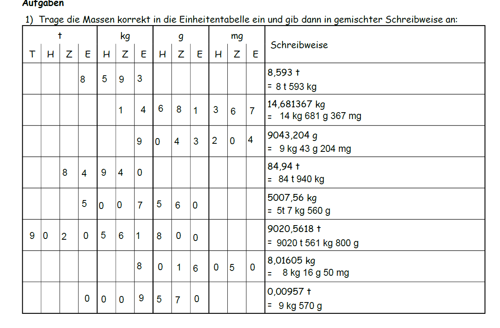

<!--
author: Susanne Suckfüll
email: su-aes@masannek.de
language: de
narrator: German Female
script: url.js

View this file on https://liascript.github.io/course/?https://raw.githubusercontent.com/SUC-AES/Mathematik-5/master/2_Massen_1.md
-->

# Massen - Jahrgang 5

**Übersicht über das Thema** ***Massen***

Das Thema Massen setzt sich aus verschiedenen Teilen zusammen. Du kannst direkt durch das Klicken auf die Links hier auf die korrekte Seite springen:

[Massen - Jahrgang 5](https://liascript.github.io/course/?https://raw.githubusercontent.com/SUC-AES/Mathe-Webseite/master/Klasse%2005/03%20Massen/M-05-03-Massen.md#1).

[01 Maßeinheiten](https://liascript.github.io/course/?https://raw.githubusercontent.com/SUC-AES/Mathe-Webseite/master/Klasse%2005/03%20Massen/01%20Ma%C3%9Feinheiten/M-05-03-01-Ma%C3%9Feinheiten.md#2)

[02 Umformen](https://liascript.github.io/course/?https://raw.githubusercontent.com/SUC-AES/Mathe-Webseite/master/Klasse%2005/03%20Massen/02%20Umformen/M-05-03-02-Umformen.md#2)

[03 Addition und Subtraktion](https://liascript.github.io/course/?https://raw.githubusercontent.com/SUC-AES/Mathe-Webseite/master/Klasse%2005/03%20Massen/03%20Addition%20und%20Subtraktion/M-05-03-03-Addition%20und%20Subtraktion.md#2)

[04 Multiplikation und Division](https://liascript.github.io/course/?https://raw.githubusercontent.com/SUC-AES/Mathe-Webseite/master/Klasse%2005/03%20Massen/04%20Multiplikation%20und%20Division/M-05-03-04-Multiplikation%20und%20Division.md#2)

[05 Übungen](https://liascript.github.io/course/?https://raw.githubusercontent.com/SUC-AES/Mathe-Webseite/master/Klasse%2005/03%20Massen/05%20%C3%9Cbungen/M-05-05-05-%C3%9Cbungen.md#2)

# Umformen

  Schreibe die Überschrift in dein Heft

>  **~~3.2 Umformen~~**

  Du kennst die Einheitentabelle bereits von den Längen.

  Für die Umrechnungszahl 1.000 hat jede Masseneinheit drei Spalten.

  **Löse nun im Kittyheft auf Seite 13 die Aufgabe 2**

  Wenn du damit fertig bist, gehe zur [nächsten Seite](#11)

##Musterlösung Kitty S. 13 Nr.2

Wenn du die Aufgabe gelöst hast, vergleiche hier deine Ergebnisse und berichtige deine Fehler.

  

>  **Damit hast du den Arbeitsauftrag für Woche 1 Tag 1 geschafft. Bis morgen!!**

##Umformungen mit Kommas

Vervollständige den Merksatz "Das Komma steht immer ...".

[[hinter dem Einer der angegebenen Einheit.]]
***********************************************************************

Schreibe den vollständigen Merksatz rot in dein Heft.

> Das Komma steht immer hinter dem Einer der angegebenen Einheit.

***********************************************************************

Dieser Merksatz erlaubt dir, wie bei den Längen die Massen in die Wertetabelle einzutragen. Wenn du möchtest, kannst du dir auch dazu wieder ein [Video von Lehrer Schmidt](https://www.youtube.com/watch?v=GK_HE9ehFlY) anschauen. Er erklärt auch direkt, wie du die Masse in einer anderen Einheit angeben kannst.

!?[movie](https://www.youtube.com/watch?v=GK_HE9ehFlY)

Nur die letzte Aussage: "1,5 Tonnen sind 1,5 Millionen Gramm" würden wir verbessern:
Schreibe die 1,5 t in g. (Beachte dabei zwischen den Dreierpäckchen und vor der Einheit ein Leezeichen zu schreiben. Z.B. "123 123 000 g")

[[1 500 000 g]]

  **Bearbeite nun im Kittyheft auf der Seite 14 die Nummern 1 und 2.**

##Musterlösung Kitty S. 14

Wenn du die Aufgabe gelöst hast, vergleiche hier deine Ergebnisse und berichtige deine Fehler.

Du kannst dir die Lösungen nacheinander anzeigen lassen. Drücke dafür oben auf den Pfeil nach rechts.

{{1-2}}
********************************

********************************

{{2-3}}
********************************

********************************

##Aussagen zum Umformungen

{{0-1}}
********************************
Versuche diese Aufgabe zuerst ohne das Pfeilbild. Wenn du dir nicht sicher bist, kannst du es natürlich versuchen.

Bei mehreren richtigen Antworten musst du alle markieren.
********************************

{{1-2}}
********************************
**Aussage 1**

  Um eine Masse in der nächstgrößeren Einheit anzugeben, muss ich das Komma ... verschieben.

    [( )] um eine Stelle nach rechts
    [( )] um eine Stelle nach links
    [( )] um zwei Stellen nach rechts
    [(X)] um drei Stellen nach links
    ********************************

{{2-3}}
********************************
**Aussage 2**

    Bei gemischten Schreibweisen muss ich beachten, dass ...

    [[X]] jede Einheit drei Stellen besitzt.
    [[X]] ich Lücken immer mit Nullen auffülle, solange sie nicht als letzte Stelle hinter dem Komma stehen.
    [[X]] nach den Tonnen immer die Kilogramm kommen.
    [[X]] die größte Einheit immer vorne steht.
    ********************************

{{3-4}}
********************************
**Aussage 3**

  Ich kann die Masse 3 783,54 kg auch als ... schreiben.

  [( )] 3 t 783 kg 54 g
  [( )] 3,783054 t
  [(X)] 3 783 540 g  
  ********************************

{{4-5}}
********************************
**Aussage 4**

  Die Masse 42 kg 37 g ist ... 42,37 kg.

  [(X)] kleiner als
  [( )] genauso groß wieder
  [( )] größer als
  ********************************

{{5-6}}
********************************
**Aussage 5**

  Um Milligramm in Tonnen umzurechnen, muss ich das Komma ... verschieben.

  [( )] um drei Stellen nach links
  [( )] um drei Stellen nach rechts
  [(X)] um neun Stellen nach links
  [( )] um neun Stellen nach rechts
  [( )] gar nicht
  ********************************

{{6-7}}
********************************
**Aussage 6**

  Wenn ich das Komma um sechs Stellen nach rechts verschiebe, wandle ich ...

  [( )] Tonnen in Kilogramm um.
  [(X)] Tonnen in Gramm um.
  [( )] Milligramm in Gramm um.
  [( )] Milligramm in Kilogramm um.

  ********************************

## Kitty S. 15

**Bearbeite nun auf der Seite 15 im Kittyheft jeweils die erste Spalte der Aufgaben 1 bis 3. Notiere dir auch schon die Lösungsbuchstaben.

Notiere dir auch die benötigte Zeit und gib dir für jede korrekte Antwort einen Punkt.**

Du erkennst an den Lösungsbuchstaben, wenn du etwas falsch gemacht hast. Du kannst stattdessen aber auch oben auf den Pfeil drücke, um die Musterlösung der Seite 15 zu erhalten.

{{1}}
***********************************

[Musterlösung - PDF](https://github.com/SUC-AES/Mathe-Webseite/blob/master/Klasse%2005/03%20Massen/Datei/2_2_Kitty_S15.pdf)

***********************************

##Checkliste

**Bearbeite nun im Kittyheft auf Seite 22 die beiden Themen "Einheiten" und "Schreibweisen" der Checkliste und übe dann selbständig auf der Seite 15 das, was du nicht konntest. Vergleiche deine Ergebnisse mit der Musterlösung der [letzten Seite](#15).**

*Freiwillig: Wer möchte kann folgende Arbeitsblätter ausdrucken und üben.*

*Achtung: Am Mittwoch Abend waren diese Seiten nicht zu erreichen. Ich hoffe, sie gehen jetzt wieder.*

[Mit Einheitentabelle - PDF](http://ne.lo-net2.de/selbstlernmaterial/m/s1ar/grma/ma_gw_au.pdf)

[Ohne Einheitentabelle - PDF](http://ne.lo-net2.de/selbstlernmaterial/m/s1ar/grma/ma_kt1.PDF)

> **Damit ist die erste Woche schon vorbei. Wir wünschen euch ein schönes Wochende!!

> Bleibt gesund und verhaltet euch so, dass es auch eure Mitmenschen bleiben!!**

#Haftung für Links

Wir sind für den Inhalt von Webseiten, die über einen Hyperlink erreicht werden, nicht verantwortlich. Für den Inhalt der verlinkten Seiten sind ausschließlich deren Betreiber verantwortlich. Wir machen uns die Inhalte dieser Internetseiten ausdrücklich nicht zu eigen und können deshalb für die inhaltliche Korrektheit, Vollständigkeit und Verfügbarkeit keine Gewähr leisten. Wir haben bei der erstmaligen Verknüpfung zwar den fremden Inhalt daraufhin überprüft, ob durch ihn eine mögliche zivilrechtliche oder strafrechtliche Verantwortlichkeit ausgelöst wird. Wir sind aber nicht dazu verpflichtet, die Inhalte, auf die wir unserem Angebot verweisen, ständig auf Veränderungen zu überprüfen, die eine Verantwortlichkeit neu begründen könnten. Erst wenn wir feststellen oder von anderen darauf hingewiesen werden, dass ein konkretes Angebot, zu dem wir einen Link bereitgestellt haben, eine zivil- oder strafrechtliche Verantwortlichkeit auslöst, werden wir den Verweis auf dieses Angebot aufheben, soweit uns dies technisch möglich und zumutbar ist.
