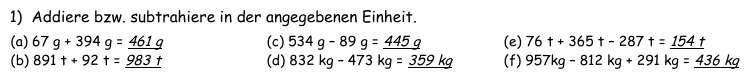
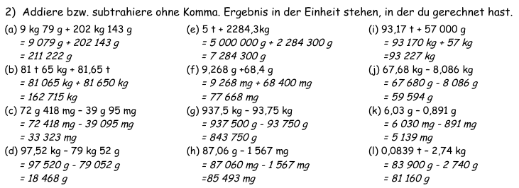
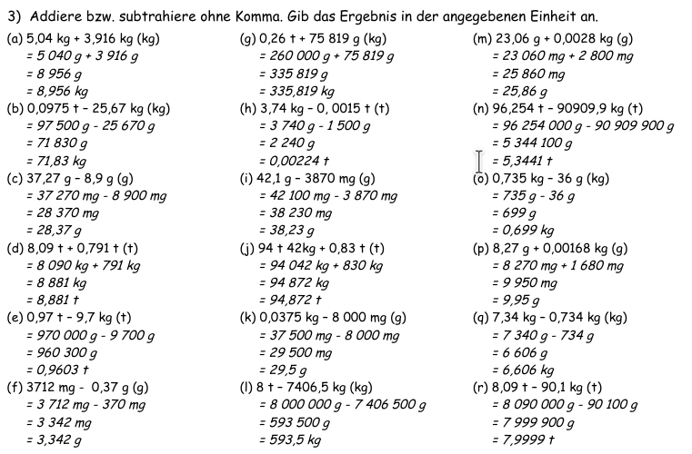
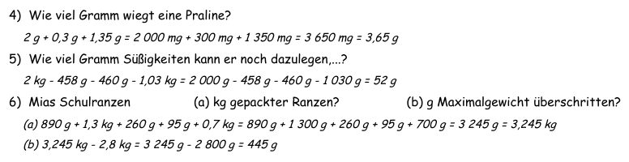

<!--
author: Susanne Suckfüll
email: su-aes@masannek.de
language: de
narrator: German Female
script: url.js

View this file on https://liascript.github.io/course/?https://raw.githubusercontent.com/SUC-AES/Mathematik-5/master/2_Massen_1.md
-->

# Massen - Jahrgang 5

**Übersicht über das Thema** ***Massen***

Das Thema Massen setzt sich aus verschiedenen Teilen zusammen. Du kannst direkt durch das Klicken auf die Links hier auf die korrekte Seite springen:

[Massen - Jahrgang 5](https://liascript.github.io/course/?https://raw.githubusercontent.com/SUC-AES/Mathe-Webseite/master/Klasse_05/03_Massen/M-05-03-Massen.md#1).

[01 Maßeinheiten](https://liascript.github.io/course/?https://raw.githubusercontent.com/SUC-AES/Mathe-Webseite/master/Klasse_05/03_Massen/01_MaBeinheiten/M-05-03-01-MaBeinheiten.md#2)

[02 Umformen](https://liascript.github.io/course/?https://raw.githubusercontent.com/SUC-AES/Mathe-Webseite/master/Klasse_05/03_Massen/02_Umformen/M-05-03-02-Umformen.md#2)

[03 Addition und Subtraktion](https://liascript.github.io/course/?https://raw.githubusercontent.com/SUC-AES/Mathe-Webseite/master/Klasse_05/03_Massen/03_Addition_und_Subtraktion/M-05-03-03-Addition_und_Subtraktion.md#2)

[04 Multiplikation und Division](https://liascript.github.io/course/?https://raw.githubusercontent.com/SUC-AES/Mathe-Webseite/master/Klasse_05/03_Massen/04_Multiplikation_und_Division/M-05-03-04-Multiplikation_und_Division.md#2)

[05 Übungen](https://liascript.github.io/course/?https://raw.githubusercontent.com/SUC-AES/Mathe-Webseite/master/Klasse_05/03_Massen/05_%C3%9Cbungen/M-05-05-05-Uebungen.md#2)

[06 Textaufgaben](https://liascript.github.io/course/?https://raw.githubusercontent.com/SUC-AES/Mathe-Webseite/master/Klasse_05/03_Massen/06_Textaufgaben/M-05-03-06-Textaufgaben.md#1)

# Addition und Subtraktion

Schreibe die Überschrift in dein Heft

>  **~~3.3 Addition und Subtraktion~~**

Wichtig ist auch folgender Merksatz, der unbedingt in rot in deinem Heft stehen sollte:

> **Um Massen zu addieren bzw. subtrahieren, müssen wir sie in die gleiche Einheit ohne Komma umformen.**

**Bearbeite nun Im Kittyheft auf der Seite 17 die Nummer 1.**

##Musterlösung Kitty S. 17 Nr. 1

Wenn du die Aufgabe gelöst hast, gib nun dein Lösungswort in GROSSBUCHSTABEN an und klicke danach auf den oberen, rechten Pfeil.

{{0-1}}
********************************************************************************

[[JAGUAR]]

********************************************************************************

{{1-2}}
********************************************************************************

Vergleiche hier deine Ergebnisse und berichtige deine Fehler.

  

********************************************************************************

##Weitere Aufgaben

Du hast bereits den Merksatz in dein Heft geschrieben. Übernimm nun auch folgende Beispiele in dein Heft.

> 3,4 kg + 832 g = 3 400 g + 832 g = 4 232 g = 4,232 kg

> 0,04 t - 9 999 g = 40 000 g - 9 999 g = 30 001 g = 30,001 kg

**Bearbeite nun im Kittyheft auf der Seite 17 von der Aufgabe 2 und 3 jeweils die erste Spalte**

## Musterlösung Kitty S. 17 Nr. 2,3

Wenn du die Aufgabe gelöst hast, vergleiche deine Ergebnisse, indem du oben auf die Pfeile klickst, und berichtige deine Fehler.

{{1-2}}
*************************************

Ergebnisse inklusive Rechenweg: Kittyheft S. 17 Nr. 2

*************************************

{{2-3}}
*************************************

Ergebnisse inklusive Rechenweg: Kittyheft S. 17 Nr. 3

*************************************

*Freiwillig: Wer möchte kann auf folgenden Seiten weitere Aufgaben üben. Mit dem Knopf "Neue Aufgabe stellen" erhältst du neue Rechnungen. Du siehst hier auch wunderbar den geforderten Rechenweg.*

[Addition](http://www.realmath.de/Neues/Klasse5/masse/massenaddieren2.html)

[Subtraktion](http://www.realmath.de/Neues/Klasse5/masse/massensub4.html)

##Übungen

Heute ist ein Übungstag.

**Bearbeite im Kittyheft auf der Seite 17 in 25 Minuten so viele Aufgaben, wie du schaffst.**

Dann vergleiche mit der [Musterlösung auf der vorherigen Seite](#5) und gib dir für jede Aufgabe einen Punkt. Berichtige auch deine Fehler.

An die Klasse 5c: Schickt eurer Mathematiklehrerin bitte eine Mail, wie viele Aufgaben und wie viele Punkte ihr in der Zeit erarbeitet habt. Schickt ihr bitte auch ein Bild von euren letzten 6 Aufgaben. Betreff der Mail: "5c Vorname Nachname"

**Bearbeite nun mindestens eine (freiwillige alle) Textaufgaben im Kittyheft auf der Seite 17**

##Musterlösungen KittyS. 17 Nr. 4,5,6

Vervollständige zuerst die Antwortsätze, die auch so oder ähnlich bei dir im Heft stehen sollten.

Vergleiche danach deinen Rechenweg mit der Musterlösung (oben auf den rechten Pfeil klicken). Es ist wichtig, dass du alle nötigen Umformungen sauber in deinem Heft stehen hast.

{{0-1}}
*********************************************************************************

**Kitty S. 17 Nr. 4**

Lea macht Pralinen, indem sie 2 g Marzipan mit 0,3 g Marmelade bestreicht und mit 1,35 g Schokolade überzieht. Wie viel Gramm wiegt eine Praline?

> Eine Praline wiegt ... g.

> [[3,65]]
***********************************************************************

> Eine Praline wiegt 3,65 g.

***********************************************************************

**Kitty S. 17 Nr. 5**

Paul möchte seinem Freund Bücher schicken. Die Bücher wiegen 458 g, 460g und 1,03 kg. Wie viel
Gramm Süßigkeiten kann er noch dazulegen, wenn das Päckchen maximal 2 kg wiegen darf?

> Er darf noch ... g dazulegen.

> [[52]]
***********************************************************************

> Er darf noch 52 g dazulegen.

***********************************************************************

**Kitty S. 17 Nr. 6**

Paul möchte seinem Freund Bücher schicken. Die Bücher wiegen 458 g, 460g und 1,03 kg. Wie viel
Gramm Süßigkeiten kann er noch dazulegen, wenn das Päckchen maximal 2 kg wiegen darf?

Mias Schulranzen wiegt 890 g. Ihre Bücher 1,3 kg, das Mäppchen 260 g, das Pausenbrot 95 g und die Wasserflasche 0,7 kg.

(a) Wie viel Kilogramm wiegt der gepackte Ranzen?

(b) Um wie viel Gramm überschreitet der Ranzen das empfohlene Maximalgewicht von 2,8 kg?

> (a) Der gepackte Ranzen wiegt ... kg.

> [[3,245]]
***********************************************************************

> (a) Der gepackte Ranzen wiegt 3,245 kg.

***********************************************************************

> (b) Der Ranzen überschreitet das empfohlene Maximalgewicht um ... g.

> [[445]]
***********************************************************************

> (b) Der Ranzen überschreitet das empfohlene Maximalgewicht um 445 g.

***********************************************************************

*********************************************************************************

{{1-2}}
***********************************************************************

***********************************************************************

#Haftung für Links

Wir sind für den Inhalt von Webseiten, die über einen Hyperlink erreicht werden, nicht verantwortlich. Für den Inhalt der verlinkten Seiten sind ausschließlich deren Betreiber verantwortlich. Wir machen uns die Inhalte dieser Internetseiten ausdrücklich nicht zu eigen und können deshalb für die inhaltliche Korrektheit, Vollständigkeit und Verfügbarkeit keine Gewähr leisten. Wir haben bei der erstmaligen Verknüpfung zwar den fremden Inhalt daraufhin überprüft, ob durch ihn eine mögliche zivilrechtliche oder strafrechtliche Verantwortlichkeit ausgelöst wird. Wir sind aber nicht dazu verpflichtet, die Inhalte, auf die wir unserem Angebot verweisen, ständig auf Veränderungen zu überprüfen, die eine Verantwortlichkeit neu begründen könnten. Erst wenn wir feststellen oder von anderen darauf hingewiesen werden, dass ein konkretes Angebot, zu dem wir einen Link bereitgestellt haben, eine zivil- oder strafrechtliche Verantwortlichkeit auslöst, werden wir den Verweis auf dieses Angebot aufheben, soweit uns dies technisch möglich und zumutbar ist.
