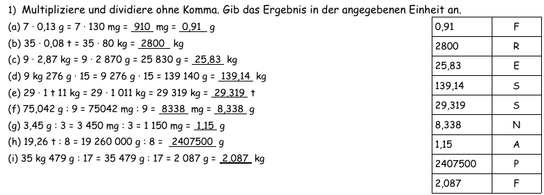
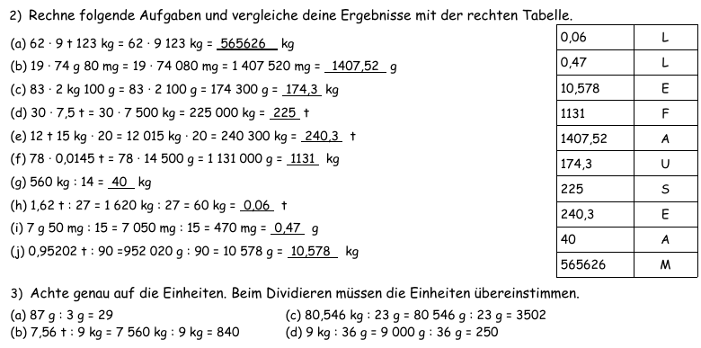
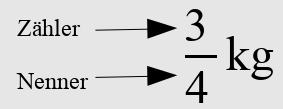
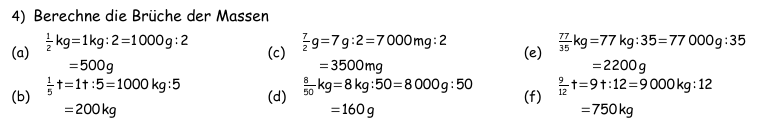

<!--
author: Susanne Suckfüll
email: su-aes@masannek.de
language: de
narrator: German Female
script: url.js

View this file on https://liascript.github.io/course/?https://raw.githubusercontent.com/SUC-AES/Mathematik-5/master/2_Massen_1.md
-->

# Massen - Jahrgang 5

**Übersicht über das Thema** ***Massen***

Das Thema Massen setzt sich aus verschiedenen Teilen zusammen. Du kannst direkt durch das Klicken auf die Links hier auf die korrekte Seite springen:

[Massen - Jahrgang 5](https://liascript.github.io/course/?https://raw.githubusercontent.com/SUC-AES/Mathe-Webseite/master/Klasse%2005/03%20Massen/M-05-03-Massen.md#1).

[01 Maßeinheiten](https://liascript.github.io/course/?https://raw.githubusercontent.com/SUC-AES/Mathe-Webseite/master/Klasse%2005/03%20Massen/01%20Ma%C3%9Feinheiten/M-05-03-01-Ma%C3%9Feinheiten.md#2)

[02 Umformen](https://liascript.github.io/course/?https://raw.githubusercontent.com/SUC-AES/Mathe-Webseite/master/Klasse%2005/03%20Massen/02%20Umformen/M-05-03-02-Umformen.md#2)

[03 Addition und Subtraktion](https://liascript.github.io/course/?https://raw.githubusercontent.com/SUC-AES/Mathe-Webseite/master/Klasse%2005/03%20Massen/03%20Addition%20und%20Subtraktion/M-05-03-03-Addition%20und%20Subtraktion.md#2)

[04 Multiplikation und Division](https://liascript.github.io/course/?https://raw.githubusercontent.com/SUC-AES/Mathe-Webseite/master/Klasse%2005/03%20Massen/04%20Multiplikation%20und%20Division/M-05-03-04-Multiplikation%20und%20Division.md#2)

[05 Übungen](https://liascript.github.io/course/?https://raw.githubusercontent.com/SUC-AES/Mathe-Webseite/master/Klasse%2005/03%20Massen/05%20%C3%9Cbungen/M-05-05-05-%C3%9Cbungen.md#2)

[06 Textaufgaben](https://liascript.github.io/course/?https://raw.githubusercontent.com/SUC-AES/Mathe-Webseite/master/Klasse%2005/03%20Massen/06%20Textaufgaben/M-05-03-06-Textaufgaben.md#1)

$\qquad$

**Weitere Themen in der Klasse 5**

[03 Größen - Massen](https://liascript.github.io/course/?https://raw.githubusercontent.com/SUC-AES/Mathe-Webseite/master/Klasse_05/03_Massen/M-05-03-Massen.md#1)

[04 Größen - Zeiten](https://liascript.github.io/course/?https://raw.githubusercontent.com/SUC-AES/Mathe-Webseite/master/Klasse_05/04_Zeiten_und_Zeitspannen/M-05-04-Zeiten_und_Zeitspannen.md#2)

[05 Größen - Gemischte Aufgaben](https://liascript.github.io/course/?https://raw.githubusercontent.com/SUC-AES/Mathe-Webseite/master/Klasse_05/05_Alle_GroeBen/M-05-05-Alle_GroeBen.md#2)

$\qquad$

[Zurück zur Klasse 5](https://liascript.github.io/course/?https://raw.githubusercontent.com/SUC-AES/Mathe-Webseite/master/Klasse_05/M05_Themen.md#2)

# Multiplikation und Division

Schreibe die Überschrift in dein Heft

>  **~~3.4 Multiplikation und Division~~**

Wichtig ist auch folgender Merksatz, der unbedingt in rot in deinem Heft stehen sollte:

> **Um eine Masse mit einer Zahl zu multiplizieren/dividieren, müssen wir sie in eine Einheit ohne Komma umformen.**

> **Um eine Masse durch eine Zahl zu dividieren, müssen wir sie in eine Einheit ohne Komma umformen. Falls die Division nicht geht, muss eine noch kleinere Einheit gewählt werden.**

> **Wir können eine Masse durch eine Masse der gleichen Einheit dividieren, beim Ergebnis fällt dann die Einheit weg.**

Schreibe auch folgende Beispiele in dein Heft:

> $1,4 kg \cdot 7 = 1400 g \cdot 7 = 9800 g = 9,8 kg$

> $1,26 t : 8 = 1 260 000 g : 8 = 157500 g = 0,157 500 t$

**Bearbeite auf der Seite 18 die Nummer 1.**

Bei der Aufgaben 1a und 1f sind die Lücken für den korrekten Rechenweg inklusive Umformungen vorgesehen.

## Musterlösung Kitty S. 18 Nr. 1

Wenn du die Aufgabe gelöst hast, gib nun dein Lösungswort in GROSSBUCHSTABEN an und klicke danach auf den oberen, rechten Pfeil.

{{0-1}}
********************************************************************************

[[FRESSNAPF]]

********************************************************************************

{{1-2}}
********************************************************************************

Vergleiche hier deine Ergebnisse und berichtige deine Fehler.

  

********************************************************************************

## Weitere Aufgaben

Heute ist ein Übungstag.

{{0-1}}
********************************************************************************

**Bearbeite im Kittyheft auf der Seite 18 in 25 Minuten so viele Aufgaben der Nummern 2 und 3, wie du schaffst.**

Dann vergleiche mit der Musterlösung, indem du auf den oberen, echten Pfeil klickst, und gib dir für jede Aufgabe einen Punkt. Berichtige auch deine Fehler.

********************************************************************************

{{1-3}}
********************************************************************************

Wenn du die Aufgabe 2 gelöst hast, gib nun dein Lösungswort in GROSSBUCHSTABEN an und klicke danach auf den oberen, rechten Pfeil für die Musterlösungen und die Rechenwege für beide Nummern 2 und 3.

[[MAUSEFALLE]]

********************************************************************************

{{2-3}}
********************************************************************************

Vergleiche hier deine Ergebnisse und berichtige deine Fehler.

  

********************************************************************************

{{3-5}}
********************************************************************************

**Bearbeite nun im Kittyheft auf der Seite 18 die Textaufgaben Nummer 5 und6**

********************************************************************************

{{3-4}}
********************************************************************************

Vervollständige zuerst die Antwortsätze, die auch so oder ähnlich bei dir im Heft stehen sollten.

Vergleiche danach deinen Rechenweg mit der Musterlösung (oben auf den rechten Pfeil klicken). Es ist wichtig, dass du alle nötigen Umformungen sauber in deinem Heft stehen hast.

**Kitty S. 18 Nr. 5**

Die 27 Schüler der 5. Klasse sammeln beim Faschingsumzug jeweils 273 g Bonbons. Wie viel Kilogramm Bonbons hat die Klasse insgesamt gesammelt?

> Die Klasse hat insgesamt ... kg gesammelt.

> [[7,371]]
***********************************

> Die Klasse hat insgesamt 7,371 kg gesammelt.

***********************************

**Kitty S. 18 Nr. 6**

6)  Familie Reiter besitzt fünf Pferde. Pro Tag frisst ein Pferd 7,5 kg Heu.

(a) Wie viel Kilogramm Heu fressen die Pferde wöchentlich?
      5 · 7 · 7,5 kg = 35 · 7,5 kg = 35 · 7 500 g = 262 500 g = 262,5 kg
(b) Wie viele Heuballen a 24 kg muss Familie Reiter wöchentlich kaufen?

> (a) Die Pferde fressen in der Woche zusammen ... kg.

> [[262,5]]
***********************************

> (a) Die Pferde fressen in der Woche zusammen 262,5 kg.

***********************************

> (b) Familie Reiter muss wöchentlich ... Ballen kaufen.

> [[11]]
***********************************

> (b) Familie Reiter muss wöchentlich 11 Ballen kaufen.

***********************************

********************************************************************************

{{4-5}}
********************************************************************************

********************************************************************************

{{5-6}}
********************************************************************************

An die Klasse 5c: Schickt eurer Mathematiklehrerin bitte eine Mail mit einem Bild eurer bearbeiteten Textaufgaben. Betreff der Mail: "5c Vorname Nachname"

********************************************************************************

## Brüche

Schreibe die Überschrift in dein Heft

> 3.5 Brüche

### Einführungsbeispiele

Diese Textaufgaben kannst du lösen, auch ohne Brüche zu kennen.

Schreibe die Textaufgaben in dein Heft. Du kannst direkt nach jeder Aufgabe rechnen. Vergleiche dann jeweisl dein Ergebnis und deinen Rechenweg mit der Musterlösung und berichtige deine Fehler.

**Aufgabe 1**

> Deine Mutter kauft 2,4 kg Hackfleisch beim Metzger. Ein Viertel davon kommt in die Bolognese-Soße. Wie viel Gramm Hackfleisch kommt in die Soße?

> [[600]]
*************************************************************

> 2,4 kg : 4 = 2 400 g : 4 = 600 g

*************************************************************

**Aufgabe 2**

> Ihr macht Nudeln auf Vorrat selber und möchtet davon einen Teil davon trocknen. Die 1,35 kg Nudeln verlieren beim Trocknen ein Drittel ihrer Masse. Wie viel Gramm verlieren die Nudeln?

> [[450]]
*************************************************************

> 1,35 kg : 3 = 1 350 g : 3 = 450 g

*************************************************************

**Aufgabe 3**

> Für ein Familienfest kauft ihr 3 kg Eiscreme. Diese soll auf 15 Familienmitglieder aufgeteilt werden. Wie viel Kilogramm Eiscreme erhält jedes Familienmitglied?

> [[0,2]]
*************************************************************

> 3 kg : 15 = 3 000 g : 15 = 200 g = 0,2 kg

*************************************************************

Falls noch nicht geschehen, vergleiche deine Ergebnisse und deinen Rechenweg mit der Musterlösung und berichtige deine Fehler.

**Rechenart**

Gib als Nomen (Addition, Subtraktion, Multiplikation und Division) an, um welche Rechenart es sich handelt.

[[Division]]
*************************************************************

Schreibe den Merksatz in dein Heft.

>Bruch bedeutet Division.

*************************************************************

### Brüche umschreiben

Übernimm nun folgenden Bruch in dein Heft und lerne die Namen der Zahlen auswendig. Du wirst sie nächstes Jahr benötigen.

> 

**Beschreibung der Vorgehensweise**

Lies dir die Vorgehensweise genau durch und schreibe die nächsten Zeilen in dein Heft. Gib dann das Endergebnis ein und überprüfe deinen Rechenweg.

*1. Schreibe den Bruch als Division. Dafür musst du die Einheit hinter die Zahl im Zähler schreiben und anstelle des Bruchs ein geteilt ":" schreiben.*

Starte mit

> $$
  \begin{aligned}
    \frac 3 4 kg & =... \\
    & =... \\
    & =... \\
    & =...\\
  \end{aligned}
  $$

Schreibe ab dem 2. Punkt in die nächste Zeile. Wenn du möchtest, kannst du es auch zuerst auf ein Schmierpapier schreiben und erst am Ende nach dem Überprüfen in dein Heft übertragen.

*2. Forme die Masse in eine kleinere Einheit um.*

*3. Berechne nun die neue Masse.*

*4. Forme in die ursprüngliche Einheit um.*

Gib nun an, wie viele kg du am Ende berechnet hast:

[[0,75]]
*************************************************************

In deinem Heft sollte folgender Rechenweg stehen:

> $$
  \begin{aligned}
    \frac 3 4 kg  & = 3 kg : 4 \\
     & = 3.000 g : 4 \\
     & = 750 g \\
     & = 0,75 kg \\
  \end{aligned}
$$

Wenn du möchtest, kannst du hinter die einzelnen Schritte die Vorgehensweise schreiben.

*************************************************************

### Übungsaufgaben

Berechne folgende Brüche und gib das Ergebnis in der gleichen Einheit an. Vergleiche nach jedem Bruch dein Rechenweg mit der Musterlösung.

Klicke auf den Pfeil nach rechts im oberen blauen Balken.

{{1-2}}
*************************

**Aufgabe 1:** $\quad \frac 3 2 ~g = ... ~g$

[[1,5]]
*************************************************************

> $$
  \begin{aligned}
    \frac 3 2 ~g  & = 3 ~g : 2 \\
     & = 3~000~ mg : 2 \\
     & = 1~500~ mg \\
     & = 1,5~ g \\
  \end{aligned}
$$
*************************************************************
*************************

{{2-3}}
*************************

**Aufgabe 2:** $\quad \frac 7 5 ~t = ... ~t$

[[1,4]]
*************************************************************

> $$
  \begin{aligned}
    \frac 7 5 ~t  & = 7 ~t:5 \\
     & = 7~000~ kg : 5 \\
     & = 1~400~ kg \\
     & = 1,4~ t \\
  \end{aligned}
$$
*************************************************************
*************************

{{3-4}}
*************************

**Aufgabe 3:** $\quad \frac 3 {20} ~g = ...~g$

[[0,15]]
*************************************************************

> $$
  \begin{aligned}
    \frac 3 {20} ~g  & = 3 ~g : 20 \\
     & = 3~000~ mg : 20 \\
     & = 150~ mg \\
     & = 0,15~ g \\
  \end{aligned}
$$
*************************************************************
*************************

{{4-5}}
*************************

**Aufgabe 4:** $\quad \frac 7 {40} ~kg = ... ~kg$

[[0,175]]
*************************************************************

> $$
  \begin{aligned}
    \frac 7 {40} ~kg  & = 7 ~kg : 40 \\
     & = 7~000~ g : 40 \\
     & = 175~ g \\
     & = 0,175~ kg \\
  \end{aligned}
$$
*************************************************************
*************************

{{5-6}}
*************************

**Aufgabe 5:** $\quad \frac{1035}{90} ~t = ... ~t$

[[11,5]]
*************************************************************

> $$
  \begin{aligned}
    \frac{1035}{90} ~t  & = 1~035 ~t : 90 \\
     & = 1~035~000 ~kg : 90 \\
     & = 11~500~ kg \\
     & = 11,5~t \\
  \end{aligned}
$$
*************************************************************
*************************

{{6-7}}
*************************

**Aufgabe 6:** $\quad \frac{85}{34} ~g = ... ~g$

[[2,5]]
*************************************************************

> $$
  \begin{aligned}
    \frac{85}{34} ~g  & = 85~g : 34 \\
     & = 85~000~ mg : 34 \\
     & = 2~500~ mg \\
     & = 2,5~ g \\
  \end{aligned}
$$
*************************************************************
*************************

{{7-8}}
*************************

**Aufgabe 7:** $\quad \frac{34}{85} ~t = ... ~t$

[[0,4]]
*************************************************************

> $$
  \begin{aligned}
    \frac{34}{85} ~t  & = 34 ~t : 85 \\
     & = 34~000~ kg : 85 \\
     & = 400~ kg \\
     & = 0,4~t \\
  \end{aligned}
$$
*************************************************************
*************************

{{8-9}}
*************************

**Aufgabe 8:** $\quad \frac{21}{28}~kg = ... ~kg$

[[0,75]]
*************************************************************

> $$
  \begin{aligned}
    \frac{21}{28}~kg  & = 21 ~kg : 28 \\
     & = 21~000~g : 28 \\
     & = 750~ g \\
     & = 0,75~ kg \\
  \end{aligned}
$$
*************************************************************
*************************

## Musterlösung Kitty S. 18 Nr. 4

Vergleiche deine Ergebnisse und deinen Rechenweg mit der Musterlösung und berichtige deine Fehler.

# Haftung für Links

Wir sind für den Inhalt von Webseiten, die über einen Hyperlink erreicht werden, nicht verantwortlich. Für den Inhalt der verlinkten Seiten sind ausschließlich deren Betreiber verantwortlich. Wir machen uns die Inhalte dieser Internetseiten ausdrücklich nicht zu eigen und können deshalb für die inhaltliche Korrektheit, Vollständigkeit und Verfügbarkeit keine Gewähr leisten. Wir haben bei der erstmaligen Verknüpfung zwar den fremden Inhalt daraufhin überprüft, ob durch ihn eine mögliche zivilrechtliche oder strafrechtliche Verantwortlichkeit ausgelöst wird. Wir sind aber nicht dazu verpflichtet, die Inhalte, auf die wir unserem Angebot verweisen, ständig auf Veränderungen zu überprüfen, die eine Verantwortlichkeit neu begründen könnten. Erst wenn wir feststellen oder von anderen darauf hingewiesen werden, dass ein konkretes Angebot, zu dem wir einen Link bereitgestellt haben, eine zivil- oder strafrechtliche Verantwortlichkeit auslöst, werden wir den Verweis auf dieses Angebot aufheben, soweit uns dies technisch möglich und zumutbar ist.
