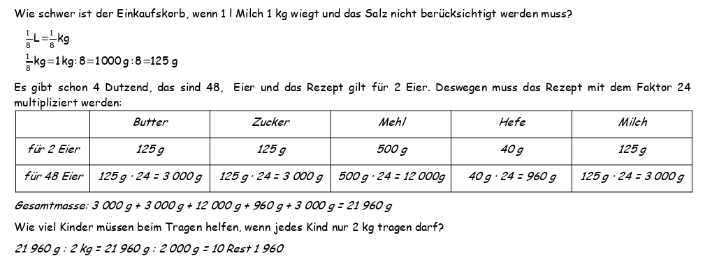

<!--
author: Susanne Suckfüll
email: su-aes@masannek.de
language: de
narrator: German Female
script: url.js

View this file on https://liascript.github.io/course/?https://raw.githubusercontent.com/SUC-AES/Mathematik-5/master/2_Massen_1.md
-->

# Massen - Jahrgang 5

**Übersicht über das Thema** ***Massen***

Das Thema Massen setzt sich aus verschiedenen Teilen zusammen. Du kannst direkt durch das Klicken auf die Links hier auf die korrekte Seite springen:

[Massen - Jahrgang 5](https://liascript.github.io/course/?https://raw.githubusercontent.com/SUC-AES/Mathe-Webseite/master/Klasse%2005/03%20Massen/M-05-03-Massen.md#1).

[01 Maßeinheiten](https://liascript.github.io/course/?https://raw.githubusercontent.com/SUC-AES/Mathe-Webseite/master/Klasse%2005/03%20Massen/01%20Ma%C3%9Feinheiten/M-05-03-01-Ma%C3%9Feinheiten.md#2)

[02 Umformen](https://liascript.github.io/course/?https://raw.githubusercontent.com/SUC-AES/Mathe-Webseite/master/Klasse%2005/03%20Massen/02%20Umformen/M-05-03-02-Umformen.md#2)

[03 Addition und Subtraktion](https://liascript.github.io/course/?https://raw.githubusercontent.com/SUC-AES/Mathe-Webseite/master/Klasse%2005/03%20Massen/03%20Addition%20und%20Subtraktion/M-05-03-03-Addition%20und%20Subtraktion.md#2)

[04 Multiplikation und Division](https://liascript.github.io/course/?https://raw.githubusercontent.com/SUC-AES/Mathe-Webseite/master/Klasse%2005/03%20Massen/04%20Multiplikation%20und%20Division/M-05-03-04-Multiplikation%20und%20Division.md#2)

[05 Übungen](https://liascript.github.io/course/?https://raw.githubusercontent.com/SUC-AES/Mathe-Webseite/master/Klasse%2005/03%20Massen/05%20%C3%9Cbungen/M-05-05-05-%C3%9Cbungen.md#2)

[06 Textaufgaben](https://liascript.github.io/course/?https://raw.githubusercontent.com/SUC-AES/Mathe-Webseite/master/Klasse%2005/03%20Massen/06%20Textaufgaben/M-05-03-06-Textaufgaben.md#1)

$\qquad$

**Weitere Themen in der Klasse 5**

[03 Größen - Massen](https://liascript.github.io/course/?https://raw.githubusercontent.com/SUC-AES/Mathe-Webseite/master/Klasse_05/03_Massen/M-05-03-Massen.md#1)

[04 Größen - Zeiten](https://liascript.github.io/course/?https://raw.githubusercontent.com/SUC-AES/Mathe-Webseite/master/Klasse_05/04_Zeiten_und_Zeitspannen/M-05-04-Zeiten_und_Zeitspannen.md#2)

[05 Größen - Gemischte Aufgaben](https://liascript.github.io/course/?https://raw.githubusercontent.com/SUC-AES/Mathe-Webseite/master/Klasse_05/05_Alle_GroeBen/M-05-05-Alle_GroeBen.md#2)

$\qquad$

[Zurück zur Klasse 5](https://liascript.github.io/course/?https://raw.githubusercontent.com/SUC-AES/Mathe-Webseite/master/Klasse_05/M05_Themen.md#2)

# Textaufgaben

  Schreibe die Überschrift in dein Heft

>  **~~3.6 Textaufgaben~~**

##Musterlösung Kitty S. 21 Nr.7

Wenn du die Aufgabe gelöst hast, vergleiche hier deine Ergebnisse und berichtige deine Fehler.

**Kitty S. 21 Nr. 7**

Die Klasse 5 Knusperhäuschen möchte blutige Hefeschnecken verkaufen.  Das Teigrezept lautet: 125  g Butter, 125 g Zucker, 500 g Mehl, 2 kleine Eier, 1 Päckchen Hefe (40g), ein Achtel Liter Milch und ein halber Teelöffel Salz. Für dieses Rezept werden 200g Erdbeersoße als Blut benötigt. Die Schüler haben bereits 4 Dutzend Eier, aus denen der Hefeteig hergestellt werden soll.

Wie schwer (in g) ist der Einkaufskorb, wenn 1 Liter Milch 1 kg wiegt und das Salz nicht berücksichtigt werden muss?

[[21960]]
[[?]] Du kannst bei Milch das Liter durch kg ersetzen.
[[?]] 1 Dutzend sind immer 12 Stück, 4 Dutzend sind dann ...
[[?]] Du kennst das Rezept für 2 Eier, schreibe es für 48 (4 Dutzend) Eier auf.
[[?]] Addiere nun alle Massen zusammen
**********************************

In deinem Heft sollten folgende Teilschritte stehen.

> Milch als Massen: $\quad \frac 1 8 ~l = \frac 1 8 ~kg$

> Daraus ergibt sich die Masse in g: $\quad \frac 1 8 ~kg = 1~kg : 8 = 1~000~g : 8 = 125 g$

> | Anzahl Eier          | Butter               | Zucker               | Mehl                  | Hefe                 | Milch                |
> | 2 Eier               | 125 g                | 125 g                | 500 g                 | 40 g                 | 125 g                |
> | 48 Eier              | $125~g \cdot 24$     | $125~g \cdot 24$     | $500~g \cdot 24$      | $40~g \cdot 24$      | $125~g \cdot 24$     |
> |                      | $= 3~000~g$          | $= 3~000~g$          | $= 12~000~g$          | $= 960~g$            | $= 3~000~g$          |

> Gesamtmasse: 3 000 g + 3 000 g + 12 000 g + 960 g + 3 000 g = 21 960 g

**********************************

Wie viel Kinder müssen beim Tragen helfen, wenn jedes Kind nur 2 kg tragen darf?

[[11]]
**********************************

In deinem Heft sollte folgender Rechenweg stehen.

> 21 960 g : 2 kg = 21 960 g : 2 000 g = 10 Rest 1 960

> Es müssen 11 Kinder sein: Zehn Kinder tragen jeweils 2 kg und das elfte Kind nur 1 960 g.

**********************************

{{1-2}}
*******************************************

Wenn du dein Ergebnis noch nicht verglichen hast, hole das jetzt nach. In deinem Heft sollten folgende Teilschritte stehen

  

*******************************************

#Haftung für Links

Wir sind für den Inhalt von Webseiten, die über einen Hyperlink erreicht werden, nicht verantwortlich. Für den Inhalt der verlinkten Seiten sind ausschließlich deren Betreiber verantwortlich. Wir machen uns die Inhalte dieser Internetseiten ausdrücklich nicht zu eigen und können deshalb für die inhaltliche Korrektheit, Vollständigkeit und Verfügbarkeit keine Gewähr leisten. Wir haben bei der erstmaligen Verknüpfung zwar den fremden Inhalt daraufhin überprüft, ob durch ihn eine mögliche zivilrechtliche oder strafrechtliche Verantwortlichkeit ausgelöst wird. Wir sind aber nicht dazu verpflichtet, die Inhalte, auf die wir unserem Angebot verweisen, ständig auf Veränderungen zu überprüfen, die eine Verantwortlichkeit neu begründen könnten. Erst wenn wir feststellen oder von anderen darauf hingewiesen werden, dass ein konkretes Angebot, zu dem wir einen Link bereitgestellt haben, eine zivil- oder strafrechtliche Verantwortlichkeit auslöst, werden wir den Verweis auf dieses Angebot aufheben, soweit uns dies technisch möglich und zumutbar ist.
