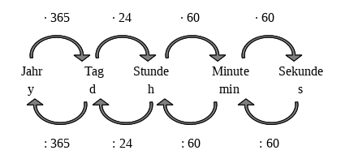

<!--
author: Susanne Suckfüll
email: su-aes@masannek.de
language: de
narrator: German Female
script: url.js

View this file on https://liascript.github.io/course/?https://raw.githubusercontent.com/SUC-AES/Mathematik-5/master/2_Massen_1.md
-->

# Massen - Jahrgang 5

**Übersicht über das Thema** ***Zeiten und Zeitspannen***

Das Thema Zeiten und Zeitspannen setzt sich aus verschiedenen Teilen zusammen. Du kannst direkt durch das Klicken auf die Links hier auf die korrekte Seite springen:

[Zeiten und Zeitspannen - Jahrgang 5]()

[01 Maßeinheiten]()

[02 Umformen]()

[03 Addition und Subtraktion]()

[04 Multiplikation und Division]()

[05 Übungen]()

[06 Textaufgaben]()

# Maßeinheiten

Beginne in deinem Heft eine neue Seite mit den beiden Überschriften, die du wie immer auch in dein Inhaltsverzeichnis schreiben sollst.

> **~~4. Größen: Zeiten und Zeitspannen ~~**

> **~~4.1 Maßeinheiten~~**

Wir rechnen insgesamt mit fünf verschiedenen Maßeinheiten (in alphabetischer Reihenfolge): Jahre, Minuten, Sekunden, Stunden und Tage.

Entscheide, wie die Einheiten der Größe nach geordnet werden:

[[größte] (zweitgrößte) (drittgrößte) (viertgrößter) [kleinste ]]
[ [X]          [ ]          [ ]           [ ]           [ ]    ] Jahr
[ [ ]          [ ]          [ ]           [X]           [ ]    ] Minuten
[ [ ]          [ ]          [ ]           [ ]           [X]    ] Sekunden
[ [ ]          [ ]          [X]           [ ]           [ ]    ] Stunden
[ [ ]          [X]          [ ]           [ ]           [ ]    ] Tage
***********************************************************************

Der Größe nach geordnet sind es: Jahr (y) - Tag (d) - Stunde (h) - Minute (min) - Sekunde (s)

***********************************************************************

## Pfeilbild

Wie immer soll in das Heft ein Pfeilbild mit den Umrechnungspfeilen. Wenn du es erklärt haben möchtest, kannst du dir folgendes [Video von Lehrer Schmidt](https://www.youtube.com/watch?v=wDnvjW-sDLc) anschauen. Lehrer Schmidt erklärt dir auch gleich einfache Umrechnungen, wie du sie danach auch lösen sollst.

!?[movie](https://www.youtube.com/watch?v=wDnvjW-sDLc)

Übernimm nun das Pfeilbild in dein Matheheft.

> 

**Übersicht über die Massen**

Übertrage die untere Aufgabe in dein Matheheft und fülle dabei auch die Lücken aus. Wenn du dies getan hast, schreibe in das untere Feld "fertig", um die Musterlösung zu erhalten.

> $$
  \begin{aligned}
    1 y  & = ...................... & d & = ...................... & h & = ...................... & min & = ...................... s \\
    1 d & = ...................... & h & = ...................... & min & = ...................... & s & \\
    1 h & = ...................... & min & = ...................... & s & & & \\
    1 min & = ...................... & s & & & & & \\
  \end{aligned}
$$

[[fertig]]
***********************************************************************

Vergeiche deine Ergebnisse und berichtige eventuelle Fehler.

Achte darauf die Zahlen in Dreierpäckchen zusammenzufassen. Du kannst sie dann viel besser lesen.

$$
  \begin{aligned}
    1 y  & = & 365 & d & = & 8.760 & h & = & 525.600 & min & = 31.536.000 s  \\
    1 d & = & 24 & h & = & 1.440 & min & = & 86.400 & s & \\
    1 h & = & 60 & min & = & 3.600 & s & & & & \\
    1 min & = & 60 & s & & & & & & & \\
  \end{aligned}
$$

***********************************************************************

##Aussagen zu den einfachen Umformungen

{{0-1}}
**********************
*Diese Seite ist eine freiwillige Aufgabe. Ich würde mich aber freuen, wenn du sie machst und mir eine kurze Rückmeldung gibst, ob sie dir geholfen haben. Falls du sie nicht machen möchtest, dann ...*

 **... löse direkt im Kittyheft auf der Seite 13 den Kasten und die Nummer 1.**

Versuche es zuerst ohne das Pfeilbild. Wenn du dir nicht sicher bist, kannst du es dir anschauen.

Bei mehreren richtigen Antworten musst du alle markieren.

Klicke oben auf den rechten Pfeil im blauen Balken. So erhältst du die erste Aufgabe.

**********************

{{1-2}}
**********************
**Aussage 1**

    Die Umrechnungszahl zwischen benachbarten Massen ist immer ...

    [( )] 10
    [( )] 100
    [(X)] 1.000
    [( )] 10.000
**********************

{{2-3}}
***************************
  **Aussage 2**

    Um von Tonnen in Gramm umzurechnen, muss ich ...

    [( )] zwei Nullen ergänzen.
    [( )] drei Nullen ergänzen.
    [(X)] sechs Nullen ergänzen.
    [( )] keines der genannten.
***************************

{{3-4}}
**********************
  **Aussage 3**

    Um von Milligramm in Gramm umzurechnen, muss ich ...

    [( )] eine Null streichen.
    [( )] eine Null ergänzen.
    [(X)] drei Nullen streichen.
    [( )] drei Nullen ergänzen.
    [( )] keines der genannten.
    **********************

{{4-5}}
**********************
  **Aussage 4**

    Wenn ich sechs Nullen ergänze, muss ich die Masse ...

    [( )] in der nächstkleineren Einheit angeben.
    [(X)] in der übernächsten kleineren Einheit angeben.
    [( )] in der nächstgrößeren Einheit angeben.
    [( )] in der übernächsten größeren Einheit angeben.
    [( )] keines der genannten.
    **********************

{{5-6}}
**********************
  **Aussage 5**

    Wenn ich eine Null streiche, muss ich die Masse ...

    [( )] in der nächstkleineren Einheit angeben.
    [( )] in der übernächsten kleineren Einheit angeben.
    [( )] in der nächstgrößeren Einheit angeben.
    [( )] in der übernächsten größeren Einheit angeben.
    [(X)] keines der genannten.
    **********************

{{6-7}}
**********************
  **Aussage 6**

    Die Masse 120.000 kg kann ich auch als ... schreiben.

    [[ ]] 12 t
    [[X]] 120 t
    [[ ]] 1.200.000.000 g
    [[X]] 120000000000 mg - jetzt wären Dreierpäckchen gut
    [[ ]] keines der genannten.

**Jetzt löse im Kittyheft auf der Seite 13 den Kasten und die Nummer 1.**

**********************

##Musterlösung Kitty S. 13 Nr. 1

  Wenn du den Kasten und die Aufgabe gelöst hast, vergleiche hier deine Ergebnisse und berichtige deine Fehler.

#Haftung für Links

Wir sind für den Inhalt von Webseiten, die über einen Hyperlink erreicht werden, nicht verantwortlich. Für den Inhalt der verlinkten Seiten sind ausschließlich deren Betreiber verantwortlich. Wir machen uns die Inhalte dieser Internetseiten ausdrücklich nicht zu eigen und können deshalb für die inhaltliche Korrektheit, Vollständigkeit und Verfügbarkeit keine Gewähr leisten. Wir haben bei der erstmaligen Verknüpfung zwar den fremden Inhalt daraufhin überprüft, ob durch ihn eine mögliche zivilrechtliche oder strafrechtliche Verantwortlichkeit ausgelöst wird. Wir sind aber nicht dazu verpflichtet, die Inhalte, auf die wir unserem Angebot verweisen, ständig auf Veränderungen zu überprüfen, die eine Verantwortlichkeit neu begründen könnten. Erst wenn wir feststellen oder von anderen darauf hingewiesen werden, dass ein konkretes Angebot, zu dem wir einen Link bereitgestellt haben, eine zivil- oder strafrechtliche Verantwortlichkeit auslöst, werden wir den Verweis auf dieses Angebot aufheben, soweit uns dies technisch möglich und zumutbar ist.
