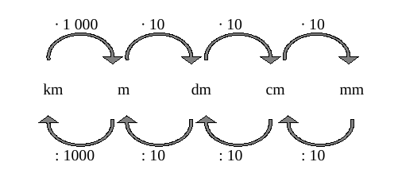
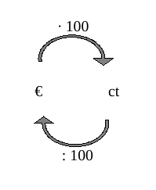

<!--
author: Susanne Suckfüll
email: su-aes@masannek.de
language: de
narrator: German Female
script: url.js

View this file on https://liascript.github.io/course/?https://raw.githubusercontent.com/SUC-AES/Mathematik-5/master/2_Massen_1.md
-->

# Alle Größen - Jahrgang 5

**Übersicht über das Thema** ***Alle Größen***

Das Thema *Alle Größen* setzt sich aus verschiedenen Teilen zusammen. Du kannst direkt durch das Klicken auf die Links hier auf die korrekte Seite springen:

[Alle Größen - Jahrgang 5](https://liascript.github.io/course/?https://raw.githubusercontent.com/SUC-AES/Mathe-Webseite/master/Klasse_05/05_Alle_GroeBen/M-05-05-Alle_GroeBen.md#2)

[01 Umformen](https://liascript.github.io/course/?https://raw.githubusercontent.com/SUC-AES/Mathe-Webseite/master/Klasse_05/05_Alle_GroeBen/01_Umformen/M-05-05-01-Umformen.md#1)

[02 Alle Rechnungen](https://liascript.github.io/course/?https://raw.githubusercontent.com/SUC-AES/Mathe-Webseite/master/Klasse_05/05_Alle_GroeBen/02_Rechnungen/M-05-05-02-Rechnungen.md#1)

[03 Brüche]()

[04 Textaufgaben](https://liascript.github.io/course/?https://raw.githubusercontent.com/SUC-AES/Mathe-Webseite/master/Klasse_05/05_Alle_GroeBen/04_Textaufgaben/M-05-05-04-Textaufgaben.md#1)

Für weitere Themen der Klassen 5 gehen Sie zurück auf die dortige Übersichtsseite:

[Zurück zur Klasse 5](https://liascript.github.io/course/?https://raw.githubusercontent.com/SUC-AES/Mathe-Webseite/master/Klasse_05/M05_Themen.md#2)

# Umformungen aller Maßeinheiten

Beginne in deinem Heft eine neue Seite mit den beiden Überschriften, die du wie immer auch in dein Inhaltsverzeichnis schreiben sollst.

> **~~5. Alle Größen ~~**

> **~~5.1 Umformen~~**

## Alle Pfeilbilder

Schaue dir nochmal die Pfeilbilder aller Einheiten an. Wenn du möchtest, kannst du sie nochmal in dein Heft übernehmen.

> ***Längeneinheiten***

> 

> ***Masseneinheiten***

> 

> ***Geldwerte***

> 

> ***Zeiteinheiten***

> 

Du kennst bereits Lehrer Schmidt. Er hat einige gute Videos gedreht. Wenn du die gesammelten Videos zu allen Einheiten anschauen willst, kannst du auf seiner Seite die entsprechenden Videos finden:

[Homepage von Lehrer Schmidt](https://www.lehrer-schmidt.de/mathematik/gr%C3%B6%C3%9Fen-ma%C3%9Feinheiten/)

Denke daran, du kannst aber auch immer in deinem eigenen Heft, im Kittyheft oder in deinem Buch nachlesen.

## Aufgaben Umformungen

Die Übungen auf der Seite 30 und 31 sind Klapptests. Klappe dir die Lösungen nach hinten weg und löse dann die Aufgaben. Wenn du fertig bist, kannst du die Lösungen wieder zurück klappen und die Ergebnisse vergleichen. Berichtige deine Fehler. Die Rechenwege zur Aufgabe 4 auf der Seite 31 findest du auf der Seite [Brüche]().

###Lösung Seite 32 Aufgabe 1a

> Forme in die angegebene Einheit um.

> $$
\begin{aligned}
83,1 ~m & = 0,0831~km \qquad & \qquad  43 m ~7 cm & = 430,7 ~dm \\
7200 ~kg & =  7,2 ~t & 84 t ~73 g & = 84000,73 ~kg\\
83,59 ~€ & =   8359 ~ct & 72 € ~9 ct & = 72,09 ~€ \\
28,71 ~dm & =   2,871 ~m & \quad 34 km~ 9 m ~2 dm & = 34009,2 ~m \\
90.06 ~g & =    90060 ~mg & 271 kg~ 5g & = 271005 ~g \\
2868 ~ct & =   28,86 ~€ & 94 € ~761 ct & = 10161  ~ct \\
9034,021 ~m & = 903402,1 ~cm & 2 m ~75 mm & = 2075 ~cm \\
56,34 ~t & =   56340000 ~g & 76 kg~ 867mg & = 76,000867 ~kg \\
38 ~€ & = 3800 ~ct & 194 €~ 67 ct & = 194,67~ € \\
53,47 ~m & =  534,7 ~dm & 53km ~47 m & = 530470 ~dm \\
84010 ~g & = 84,01 ~kg & 1 kg ~85 g ~3 mg & = 1085,003 ~g \\
9250 ~€ & = 925000 ~ct & 94 €~ 2 ct & = 94,02~ € \\
\end{aligned}
$$

###Lösung Seite 32 Aufgabe 1b

> Gib in gemischter Schreibweise an. Einheiten, die nicht vorkommen, müssen nicht geschrieben werden.

> $$
\begin{aligned}
1942,867 ~m & =  1 km  ~942 m \\
59267,56 ~kg & = 59 t ~267 kg 560 g \\
38044,06 ~m & = 38 km ~44 m ~6 cm \\
0,06840002 ~t & = 68 kg ~400 g ~20 mg \\
0,030907 ~km & = 30 m ~9 dm ~7 mm \\
2907,26081 ~kg & = 2 t ~907 kg ~260 g ~81 mg \\
\end{aligned}
$$

###Lösung Seite 32 Aufgabe 2a

> Zeiten umrechnen: Gib in der angegebenen Einheit an.

> $$
\begin{aligned}
17 ~h & = 61.200 ~s & 3 h~ 23 min & = 203 ~min \\
771 ~min & = 46.260 ~s & 11 d ~11 h ~1 min & = 16.501 ~min \\
75.600 ~s & = 21 ~h & 36 min ~27 s & =   2.187 ~s \\
1.870 ~min & = 1d ~10 h ~10 min \qquad & 7 h ~21 min ~37 s & =   26.497 ~s \\
\end{aligned}
$$

###Lösung Seite 32 Aufgabe 2b

> Zeiten umrechnen: Gib in gemischter Schreibweise an.

> $$
\begin{aligned}
9 .317 ~s & = 155 min ~17 s && = 2 h ~35 min ~17 s \\
34 .561 ~s & =  576 min ~1 s && = 9 h ~36 min ~1 s \\
7 .589 ~min & =  126 h ~29 min && = 5 d ~6 h ~29 min \\
41 .289 ~min & =   688 h ~9 min && = 28 d ~16 h ~9 min \\
\end{aligned}
$$

##Externe Übung

**Freiwillig:**

*Aufgabenfuchs*

Wenn du noch weitere Übungen machen möchtest, kannst du dir folgende Seite bei dem Aufgabenfuchs ansehen:

[Aufgabenfuchs](https://mathe.aufgabenfuchs.de/groessen/einfache-groessen-umrechnen.shtml)

Hier findest du Umrechnungsübungen zu vielen Einheiten. Du kannst dir bei jeder Größe die Einheiten einstellen, zwischen denen denen umrechnen willst.

Mit dem Button "Neu" erhaltet ihr neue Aufgaben mit "Auswertung" könnt ihr eure Ergebnisse überprüfen.

*Lo-net Selbstlernmaterial*

Eine weitere tolle Seite ist von Thomas Unkelbach. Merke sie dir gut, du findest hier Aufgaben bis hoch zum Abitur. Einige Sachen erkennt ihr vielleicht wieder.

[Selbstlernmaterial - Längen](http://ne.lo-net2.de/selbstlernmaterial/m/s1ar/grla/grlaindex.html)

[Selbstlernmaterial - Massen](http://ne.lo-net2.de/selbstlernmaterial/m/s1ar/grma/grmaindex.html)

[Selbstlernmaterial - Geldwerte](http://ne.lo-net2.de/selbstlernmaterial/m/s1ar/grge/grgeindex.html)

[Selbstlernmaterial - Zeiten](http://ne.lo-net2.de/selbstlernmaterial/m/s1ar/grze/grzeindex.html)

[Selbstlernmaterial - Gemischte Übungen](http://ne.lo-net2.de/selbstlernmaterial/m/s1ar/grve/grveindex.html)

*Weitere Linksammlung*

Diese Linksammlung wird vom staatlichen Schulamt empfohlen. Einige Links kennt ihr bereits.

[Linksammlung - Onlineübung](http://onlineuebung.de/mathe/rechnen-mit-groessen/)

#Haftung für Links

Wir sind für den Inhalt von Webseiten, die über einen Hyperlink erreicht werden, nicht verantwortlich. Für den Inhalt der verlinkten Seiten sind ausschließlich deren Betreiber verantwortlich. Wir machen uns die Inhalte dieser Internetseiten ausdrücklich nicht zu eigen und können deshalb für die inhaltliche Korrektheit, Vollständigkeit und Verfügbarkeit keine Gewähr leisten. Wir haben bei der erstmaligen Verknüpfung zwar den fremden Inhalt daraufhin überprüft, ob durch ihn eine mögliche zivilrechtliche oder strafrechtliche Verantwortlichkeit ausgelöst wird. Wir sind aber nicht dazu verpflichtet, die Inhalte, auf die wir unserem Angebot verweisen, ständig auf Veränderungen zu überprüfen, die eine Verantwortlichkeit neu begründen könnten. Erst wenn wir feststellen oder von anderen darauf hingewiesen werden, dass ein konkretes Angebot, zu dem wir einen Link bereitgestellt haben, eine zivil- oder strafrechtliche Verantwortlichkeit auslöst, werden wir den Verweis auf dieses Angebot aufheben, soweit uns dies technisch möglich und zumutbar ist.
