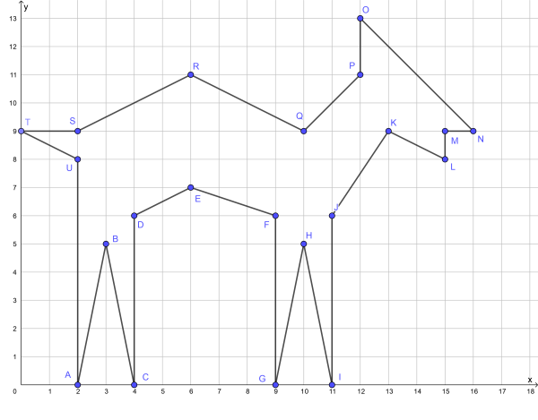
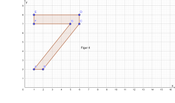

<!--
author: Susanne Suckfüll
email: su-aes@masannek.de
language: de
narrator: German Female
script: url.js

View this file on https://liascript.github.io/course/?https://raw.githubusercontent.com/SUC-AES/Mathematik-5/master/2_Massen_1.md
-->

# Geometrie - Jahrgang 5

Das Thema *Geometrie* setzt sich aus verschiedenen Teilen zusammen. Du kannst direkt durch das Klicken auf die Links hier auf die korrekte Seite
springen:

**Übersicht über das Thema** ***Geometrie***

[Geometrie - Jahrgang 5](https://liascript.github.io/course/?https://raw.githubusercontent.com/SUC-AES/Mathe-Webseite/master/Klasse_05/06_Geometrie/M-06-Geometrie.md#1)

[01 Koordinatensystem](https://liascript.github.io/course/?https://raw.githubusercontent.com/SUC-AES/Mathe-Webseite/master/Klasse_05/06_Geometrie/01_Koordinatensystem/M-06-01-01-Koordinatensystem.md#2)

$\qquad$

[Zurück zur Klasse 5](https://liascript.github.io/course/?https://raw.githubusercontent.com/SUC-AES/Mathe-Webseite/master/Klasse_05/M05_Themen.md#2)

# Koordinatensystem

Beginne in deinem Heft eine neue Seite mit den beiden Überschriften, die du wie immer auch in dein Inhaltsverzeichnis schreiben sollst.

> **~~6. Geometrie ~~**

> **~~6.1 Koordinatensystem~~**

Wie auch bei den anderen Themen gibt es hier ein [Video von Lehrer Schmidt](https://www.youtube.com/watch?v=NAaR4nL0Joo), in dem ihr viel über das Thema "Koordinatensystem" lernen könnt:

!?[movie](https://www.youtube.com/watch?v=NAaR4nL0Joo)

Übernimm nun aus deinem Mathematikbuch Seite 61 den blauen Kasten in dein Heft. Zeichne auch das Koordinatensystem ab und beachte, dass an beide Achsen Pfeile gehören. Das kennst du bereits von den Diagrammen. Die *x-Achse* geht immer von links nach rechts, die *y-Achse* von unten nach oben. Die Achsen müssen auch mit diesen Buchstaben beschriftet werden. Wichtig ist ebenfalls, dass du die Zahlen immer 1 cm (also 2 Kästchen) auseinander schreibst.

## Punkte einzeichnen

Bearbeite im Buch auf der Seite 62 die Aufgabe 2.

Zeichne dazu ein Koordinatensystem in dein Heft. Zeichne mit Bleistift und beschrifte die Punkte immer mit dem Buchstaben (GROSSBUCHSTABE), der dazu gehört.

Gib an, wie das Bild aussieht, du siehst dann auch eine Grafik, ob du richtig gezeichnet hast. Sollte ein Punkt falsch eingezeichnet sein, berichtige deinen Fehler.

[[Schiff]]
************************************************

> 

************************************************

$\qquad$

**Bizz-Heft Seite 2**

Vervollständige zuerst den oberen Kasten. Wenn du dies getan hast, dann gibt FERTIG in den Kasten ein und vergleiche dein Ergebnis mit der Musterlösung.

[[FERTIG]]
************************************************

> Das linke Koordinatensystem besteht aus einer x-Achse. Diese verläuft von *links* nach *rechts*. Die x-Achse wurde um eine y-Achse ergänzt, die von *unten* nach *oben* verläuft.

> In das Koordinatensystem werden Punkte als Kreuze eingezeichnet.

> Ein Punkt besteht aus einer x-Koordinate, diese entspricht dem Wert auf der x-Achse und einer y-Koordinate, dem Wert der y-Achse. Die Punkte werden mit P ( x / y ) angegeben.

> Sprich: „Der Punkt P ist x Stab y.“

************************************************

$\quad$

Bearbeite nun im Bizz-Heft auf der Seite 2 die Aufgaben 1 bis 3. Auch hier gilt: Verbinde die Punkte in alphabetischer Reihenfolge und schreibe in die Lösung, was du gezeichnet hast, um die Musterlösung zu sehen.

> Zeichne die Punkte jeweils in ein passendes Koordinatensystem und verbinde sie in alphabetischer Reihenfolge. Welches Symbol ergibt sich?

> Seite 2 Aufgabe 1

> A (3/4); B (1/4); C (1/5); D (6/5); E (6/4); F (4/4); G (4/1); H (3/1)

[[T]]
************************************************

> 

************************************************

> Seite 2 Aufgabe 2a

> A (1/2); B (3/2); C (3/1); D (5/3); E (3/5); F (3/4); G (1/4)

[[Pfeil]]
************************************************

> 

************************************************

> Seite 2 Aufgabe 2b

> A (1/1); B (4/1); C (2/2); D (3/5); E (1/5)

[[Stiefel]]
************************************************

> 

************************************************

> Seite 2 Aufgabe 3

> (2/0) -> (3/5) -> (4/0)	-> (4/6) -> (6/7) -> (9/6) -> (9/0) -> (10/5) -> (11/0) -> (11/6) -> (13/9) -> (15/8) -> (15/9) -> (16/9) -> (12/13) -> (12/11) -> (10/9) -> (6/11) -> (2/9) -> (0/9) -> (2/8) -> Anfang

[[Reh]]
************************************************

> 

************************************************

## Punkte ablesen

> Um Punkte in einem Koordinatensystem abzulesen, gehe wie folgt vor:

> • Denke dir eine Linie nach unten bis zur x-Achse und lies den x-Wert ab.

> • Denke dir eine Linie nach links bis zur y-Achse und lies den y-Wert ab.

> • Gib den Punkt mit einem Großbuchstaben an, indem du zuerst den x- und dann den y-Wert angibst.

$\quad$

**Bizz-Heft Seite 3**

> Seite 3 Aufgabe 1

Lies die Punkte ab und gib die y-Koordinate des letzten Punktes G ein, um die komplette Musterlösung zu sehen

[[1]]
************************************************

A (1/2), B (2/5), C (5/7), D (4/5), E (0/4), F (5/3), G (7/1)

************************************************

> Seite 3 Aufgabe 2a

Lies die Punkte der Lokomotive ab und gib die x-Koordinate des letzten Punktes R ein, um die komplette Musterlösung zu sehen

[[2]]
************************************************

A (1/2), B (2/3), C (2/5), D (1/6), E (4/6), F (3/5), G (3/4), H (5/4), I (5/7), J (9/7), K (8/6), L (8/2), M (7/1), N (6/1), O (5/2), P (4/2), Q (3/1), R (2/1)

************************************************

Lies die Punkte des Wagens ab und gib die x-Koordinate des letzten Punktes J' ein, um die komplette Musterlösung zu sehen

[[9]]
************************************************

A' (9/5), B' (16/5), C' (16/2), D' (15/1), E' (14/1), F' (13/2), G' (12/2), H' (11/1), I' (10/1), J' (9/2)

************************************************

## Weitere Zeichenaufgaben

Zeichne die Punkte einer Aufgabe jeweils in ein eigenes Koordinatensystem und verbinde sie der Reihe nach. Gib an, um was es sich bei deiner Figur handelt.

> Aufgabe 1: ( 2 / 1 ) -> ( 8 / 1 ) -> ( 8 / 5 ) -> ( 7 / 6 ) -> ( 7 / 8 ) -> ( 6 / 8 ) -> ( 6 / 7 ) -> ( 5 / 8 ) -> ( 2 / 5 ) -> ( 2 / 1 )

[[Haus]]
**************************************

> 

**************************************

> Aufgabe 2: ( 2 / 1 ) -> ( 7 / 1 ) -> ( 8 / 3 ) -> (4 / 3 ) -> ( 4 / 5 ) -> ( 7 / 5 ) -> ( 3 / 8 ) -> ( 3 / 3 ) -> ( 1 / 3 ) -> ( 2 / 1 )

[[Schiff]]
**************************************

> 

**************************************

> Aufgabe 3: ( 2 / 2 ) -> ( 3 / 1 ) -> ( 5 / 1 ) -> ( 6 / 2 ) -> ( 6 / 6 ) -> ( 5 / 4 ) -> ( 4 / 6 ) -> ( 3 / 4 ) -> ( 2 / 6 ) -> ( 2 / 2 )

[[Tulpe]]
**************************************

> 

**************************************

> Aufgabe 4: ( 1 / 2 )-> ( 2 / 2 ) -> ( 6 / 7 ) -> ( 6 / 8 ) -> ( 1 / 8 ) -> ( 1 / 7 ) -> ( 5 / 7 ) -> ( 1 / 2 )

[[7]]
**************************************

> 

**************************************

> Aufgabe 5: ( 2 / 1 ) -> ( 4 / 1 ) -> ( 10 / 7 ) -> ( 8 / 7 ) -> ( 6 / 5 ) -> ( 4 / 7 ) -> ( 2 / 7 ) -> ( 5 / 4 ) -> ( 2 / 1 )

[[Y]]
**************************************

> 

**************************************

> Aufgabe 6: ( 1 / 1 ) -> ( 2 / 1 ) -> ( 3 / 3 ) -> ( 5 / 3 ) -> ( 6 / 1 ) -> ( 7 / 1 ) -> ( 4 / 7 ) -> ( 1 / 1 )

[[A]]
**************************************

> 

**************************************

## Externe Links - Geogebra

Geogebra ist ein kostenloses, dynamisches Mathematik-Computerprogramm. Es läuft auf allen Betriebssystemen und kann auch auf dem Tablett oder Handy als kostenlose App genutzt werden. Wir werden hier nur Applets benutzen, die im Browser laufen.

**Autorin Birgit Lachner**

[Koordinaten von Punkten ... wie war das gleich?](https://www.geogebra.org/m/DrGpByXD)

[ÜBUNG: Punkte einstellen](https://www.geogebra.org/m/d6EMX5f9)

[ÜBUNG: Ablesen von Koordinaten](https://www.geogebra.org/m/CHT8zP8s)

**GeoGebra Translation Team German**

[Ordne Punkte Koordinaten zu](https://www.geogebra.org/m/HvaK6bmn)

[Koordinaten von Punkten ablesen](https://www.geogebra.org/m/SkuasskG)

#Haftung für Links

Wir sind für den Inhalt von Webseiten, die über einen Hyperlink erreicht werden, nicht verantwortlich. Für den Inhalt der verlinkten Seiten sind ausschließlich deren Betreiber verantwortlich. Wir machen uns die Inhalte dieser Internetseiten ausdrücklich nicht zu eigen und können deshalb für die inhaltliche Korrektheit, Vollständigkeit und Verfügbarkeit keine Gewähr leisten. Wir haben bei der erstmaligen Verknüpfung zwar den fremden Inhalt daraufhin überprüft, ob durch ihn eine mögliche zivilrechtliche oder strafrechtliche Verantwortlichkeit ausgelöst wird. Wir sind aber nicht dazu verpflichtet, die Inhalte, auf die wir unserem Angebot verweisen, ständig auf Veränderungen zu überprüfen, die eine Verantwortlichkeit neu begründen könnten. Erst wenn wir feststellen oder von anderen darauf hingewiesen werden, dass ein konkretes Angebot, zu dem wir einen Link bereitgestellt haben, eine zivil- oder strafrechtliche Verantwortlichkeit auslöst, werden wir den Verweis auf dieses Angebot aufheben, soweit uns dies technisch möglich und zumutbar ist.
