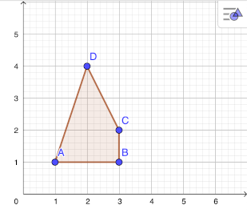
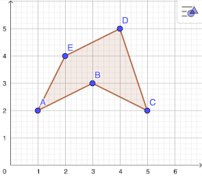
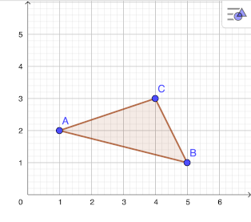
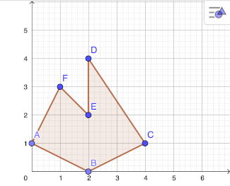
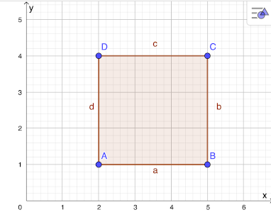
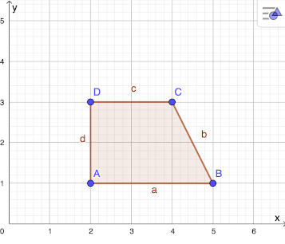
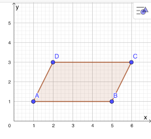
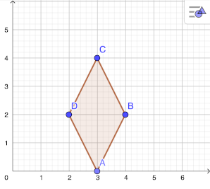
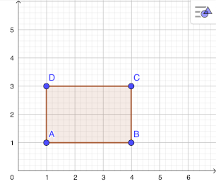
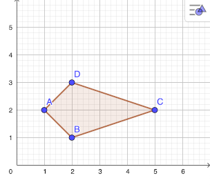

<!--
author: Susanne Suckfüll
email: su-aes@masannek.de
language: de
narrator: German Female
script: url.js

View this file on https://liascript.github.io/course/?https://raw.githubusercontent.com/SUC-AES/Mathematik-5/master/2_Massen_1.md
-->

# Geometrie - Jahrgang 5

Das Thema *Geometrie* setzt sich aus verschiedenen Teilen zusammen. Du kannst direkt durch das Klicken auf die Links hier auf die korrekte Seite
springen:

**Übersicht über das Thema** ***Geometrie***

[Geometrie - Jahrgang 5](https://liascript.github.io/course/?https://raw.githubusercontent.com/SUC-AES/Mathe-Webseite/master/Klasse_05/06_Geometrie/M-05-06-Geometrie.md#1)

[01 Koordinatensystem](https://liascript.github.io/course/?https://raw.githubusercontent.com/SUC-AES/Mathe-Webseite/master/Klasse_05/06_Geometrie/01_Koordinatensystem/M-05-06-01-Koordinatensystem.md#2)

[06 Vierecke und andere Vielecke](https://liascript.github.io/course/?https://raw.githubusercontent.com/SUC-AES/Mathe-Webseite/master/Klasse_05/06_Geometrie/06_Vierecke/M-05-06-06-Vierecke.md#2)

$\qquad$

**Weitere Themen der Klasse 5**

[03 Größen - Massen](https://liascript.github.io/course/?https://raw.githubusercontent.com/SUC-AES/Mathe-Webseite/master/Klasse_05/03_Massen/M-05-03-Massen.md#1)

[04 Größen - Zeiten](https://liascript.github.io/course/?https://raw.githubusercontent.com/SUC-AES/Mathe-Webseite/master/Klasse_05/04_Zeiten_und_Zeitspannen/M-05-04-Zeiten_und_Zeitspannen.md#2)

[05 Größen - Gemischte Aufgaben](https://liascript.github.io/course/?https://raw.githubusercontent.com/SUC-AES/Mathe-Webseite/master/Klasse_05/05_Alle_GroeBen/M-05-05-Alle_GroeBen.md#2)

[06 Geometrie - Jahrgang 5](https://liascript.github.io/course/?https://raw.githubusercontent.com/SUC-AES/Mathe-Webseite/master/Klasse_05/06_Geometrie/M-05-06-Geometrie.md#1)

$\qquad$

[Zurück zur Klasse 5](https://liascript.github.io/course/?https://raw.githubusercontent.com/SUC-AES/Mathe-Webseite/master/Klasse_05/M05_Themen.md#2)

#Vierecke und andere Vielecke

Übernimm die folgende Überschrift in dein Heft

> **~~6.2 Vierecke und andere Vielecke~~**

Zum Wiederholen der Koordinatensysteme zeichne bitte jede der folgende Figuren in ein eigenes Koordinatensystem. Wenn du damit fertig bist, entscheide, welches Vieleck beziehungsweise welches besondere Viereck hier vorliegt. Gib das bei der Frage an und erhalte die Musterlösung. Vergleiche und berichtige eventuelle Fehler.

## Vielecke zeichnen

Achte beim Koordinatensystem darauf

* die Achsen korrekt mit x (nach rechts) und y (nach oben) zu beschriften,
* zwischen 0 und 1, 1 und 2 sowie allen anderen Zahlen den Abstand von 1 cm einzuhalten.

Zeichne vier Koordinatensysteme (x- und y-Achse jeweils bis 5) in dein Heft und dann die Punkte einer Aufgabe jeweils in ein eigenes Koordinatensystem und verbinde sie der Reihe nach. Gib an, um welches Vieleck es sich handelt: *Dreieck, Viereck, Fünfeck, Sechseck:*

> Figur 1: A(1/1);  B(3/1);  C(3/2);  D(2/4)

[[Viereck]]
*************************************************

> 

*************************************************

> Figur 2: A(1/2);  B(3/3);  C(5/2);  D(4/5);  E(2/4)

[[Fünfeck]]
*************************************************

> 

*************************************************

> Figur 3: A(1/2);  B(5/1);  C(4/3)

[[Dreieck]]
*************************************************

> 

*************************************************

> Figur 4: A(0/1);  B(2/0);  C(4/1);  D(2/4);  E(2/2);  F(1/3)

[[Sechseck]]
*************************************************

> 

*************************************************

## Vierecke zeichnen

Zeichne sechs Koordinatensysteme (x-Ache bis 6 und y-Achse bis 5) in dein Heft und dann die Punkte einer Aufgabe jeweils in ein eigenes Koordinatensystem und verbinde sie der Reihe nach. Vergleiche deine gezeichneten Viereck mit den Vierecken auf der Seite 18 im Bizz-Heftbzw. mit der Seite 72 in deinem Mathebuch. Gib an, um welches besondere Viereck es sich bei deinen Figuren handelt.

> Figur 1: A(2/1);  B(5/1);  C(5/4);  D(2/4)

[[Quadrat]]
*************************************************

> 

*************************************************

> Figur 2: A(2/1);  B(5/1);  C(4/3);  D(2/3)

[[Trapez]]
*************************************************

> 

*************************************************

> Figur 3: A(1/1);  B(5/1);  C(6/3);  D(2/3)

[[Parallelogramm]]
*************************************************

> 

*************************************************

> Figur 4: A(3/0);  B(4/2);  C(3/4);  D(2/2)

[[Raute]]
*************************************************

> 

*************************************************

> Figur 5: A(1/1);  B(4/1);  C(4/3);  D(1/3)

[[Rechteck]]
*************************************************

> 

*************************************************

> Figur 6: A(1/2);  B(2/1);  C(5/2);  D(2/3)

[[Drache]]
*************************************************

> 

*************************************************

# Externe Links

**~~Lehrer Schmidt~~**

[Lehrer Schmidt](https://www.youtube.com/watch?v=Ve-Hzdc47Tk) erklärt auch nochmal, welche verschiedenen Vierecke es gibt. Du kannst dir sein Video anschauen. Beachte, dass er alle gleich langen Seiten mit dem gleichen Buchstaben benennt. Wir machen das anders, du erfährst in der Schule wie es richtig wäre, hilft dir vielleicht aber beim Verständnis.

!?[movie](https://www.youtube.com/watch?v=Ve-Hzdc47Tk)

$\quad$

**~~Aufgabenfuchs~~**

Auf der Seite des [Aufgabenfuchses](https://www.aufgabenfuchs.de/mathematik/flaeche/viereck/vierecksarten.shtml) finden sich auch schöne Aufgaben zu Vierecken.

Diese beinhalten aber mehr Informationen, als ihr bisher kennt. Bearbeite daher die Aufgaben 1 und 3a. Ziehe bei der Aufgabe 1 die Punkte so, dass du jeden Vierecktyp einmal dargestellt hast. Freiwillig kannst du auf dieser Seite auch noch die Aufgabe 8 bearbeiten.

[Aufgabenfuchs - Vierecke](https://www.aufgabenfuchs.de/mathematik/flaeche/viereck/vierecksarten.shtml)

$\quad$

**~~Geogebra:~~ Nur für Könner**

Geogebra kennst du bereits von den Koordinatensystemen. Es gibt fertige Aktivitäten, die du machen kannst.

Der Inhalt dieser Seiten führen über den bekannten Stoff hinaus. Sie sind für diejenigen von euch gedacht, die viel Spaß an Mathematik haben und schon mehr ausprobieren wollen! Die übrigen müssen die Seiten nicht machen.

Beachte folgende Tipps zu den einzelnen Seiten:

[GEOGEBRA - Namen zuordnen](https://www.geogebra.org/m/RzsgsgR7#material/LaXSGHqP)
MIT WEITEREN VIERECKEN

Bei dieser Seite sollst du die Begriffe den Bildern zuordnen. Dabei  wird der Drache Deltoid genannt. Auch findest du hier weitere Vierecke, die du bisher nicht kanntest. Du brauchst diese Namen vorerst aber noch nicht.

[GEOGEBRA - Eigenschaften zuordnen](https://www.geogebra.org/m/RzsgsgR7#material/lNn1FVX7)
SCHWIERIG

Bei dieser Seite wird auch auf Winkel und Symmetrie eingegangen. Diese haben wir noch nicht besprochen, vielleicht kennst du die Begriffe noch aus der Grundschule und kannst die Aufgaben trotzdem lösen.

#Haftung für Links

Wir sind für den Inhalt von Webseiten, die über einen Hyperlink erreicht werden, nicht verantwortlich. Für den Inhalt der verlinkten Seiten sind ausschließlich deren Betreiber verantwortlich. Wir machen uns die Inhalte dieser Internetseiten ausdrücklich nicht zu eigen und können deshalb für die inhaltliche Korrektheit, Vollständigkeit und Verfügbarkeit keine Gewähr leisten. Wir haben bei der erstmaligen Verknüpfung zwar den fremden Inhalt daraufhin überprüft, ob durch ihn eine mögliche zivilrechtliche oder strafrechtliche Verantwortlichkeit ausgelöst wird. Wir sind aber nicht dazu verpflichtet, die Inhalte, auf die wir unserem Angebot verweisen, ständig auf Veränderungen zu überprüfen, die eine Verantwortlichkeit neu begründen könnten. Erst wenn wir feststellen oder von anderen darauf hingewiesen werden, dass ein konkretes Angebot, zu dem wir einen Link bereitgestellt haben, eine zivil- oder strafrechtliche Verantwortlichkeit auslöst, werden wir den Verweis auf dieses Angebot aufheben, soweit uns dies technisch möglich und zumutbar ist.
