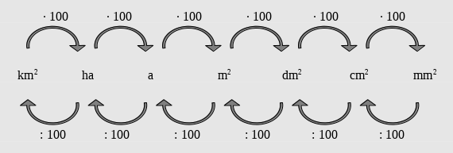

<!--
author: Susanne Suckfüll
email: su-aes@masannek.de
language: de
narrator: German Female
script: url.js

View this file on https://liascript.github.io/course/?https://raw.githubusercontent.com/SUC-AES/Mathematik-5/master/2_Massen_1.md
-->

# Geometrie - Jahrgang 5

Das Thema *Geometrie* setzt sich aus verschiedenen Teilen zusammen. Du kannst direkt durch das Klicken auf die Links hier auf die korrekte Seite
springen:

**Übersicht über das Thema** ***Geometrie***

[Geometrie - Jahrgang 5](https://liascript.github.io/course/?https://raw.githubusercontent.com/SUC-AES/Mathe-Webseite/master/Klasse_05/06_Geometrie/M-05-06-Geometrie.md#1)

[01 Koordinatensystem](https://liascript.github.io/course/?https://raw.githubusercontent.com/SUC-AES/Mathe-Webseite/master/Klasse_05/06_Geometrie/01_Koordinatensystem/M-05-06-01-Koordinatensystem.md#2)

[06 Vierecke und andere Vielecke](https://liascript.github.io/course/?https://raw.githubusercontent.com/SUC-AES/Mathe-Webseite/master/Klasse_05/06_Geometrie/06_Vierecke/M-05-06-06-Vierecke.md#2)

[08 Flächeninhalte]()

$\qquad$

**Weitere Themen der Klasse 5**

[03 Größen - Massen](https://liascript.github.io/course/?https://raw.githubusercontent.com/SUC-AES/Mathe-Webseite/master/Klasse_05/03_Massen/M-05-03-Massen.md#1)

[04 Größen - Zeiten](https://liascript.github.io/course/?https://raw.githubusercontent.com/SUC-AES/Mathe-Webseite/master/Klasse_05/04_Zeiten_und_Zeitspannen/M-05-04-Zeiten_und_Zeitspannen.md#2)

[05 Größen - Gemischte Aufgaben](https://liascript.github.io/course/?https://raw.githubusercontent.com/SUC-AES/Mathe-Webseite/master/Klasse_05/05_Alle_GroeBen/M-05-05-Alle_GroeBen.md#2)

[06 Geometrie](https://liascript.github.io/course/?https://raw.githubusercontent.com/SUC-AES/Mathe-Webseite/master/Klasse_05/06_Geometrie/M-05-06-Geometrie.md#1)

$\qquad$

[Zurück zur Klasse 5](https://liascript.github.io/course/?https://raw.githubusercontent.com/SUC-AES/Mathe-Webseite/master/Klasse_05/M05_Themen.md#2)

#Flächeninhalt

Übernimm die folgende Überschrift in dein Heft

> **~~6.3 Flächeninhalt~~**

Dieses Thema hat mehrere Unterthemen, die du bearbeiten sollst.

#Maßeinheiten

Übernimm die folgende Überschrift in dein Heft

> **~~A) Maßeinheiten~~**

Heute arbeitet ihr mit dem Buch. Wichtig für die Flächen und für euer "Gefühl" für die Flächen ist es, sich die Größe einer Fläche gut vorstellen zu können. Bis auf die Einheit Hektar (ha) und Ar (a) werden alle Einheiten durch die Seitenlänge des Quadrats beschrieben. Aus der Seitenlänge des Quadrats 1 km wird die Flächeneinheit $1 km^2$, aus der Seitenlänge des Quadrats 1 cm wird die Flächeneinheit $1 cm^2,$ etc. Da es aber zwischen einem Quadratkilometer und einem Quadratmeter viele Flächen gibt, kommt es zu den zusätzlichen Einheiten Hektar und Ar.

Schreibt heute bitte die Seite 155 (in Schönschrift) bis auf das Pfeilbild ab in euer Heft. Die Tabelle im blauen Kasten ist sehr wichtig, nehmt dafür eine eigene Seite in eurem Heft und legt das Heft quer. Male schöne Bilder, um die Größenvorstellung richtig darzustellen.

Zeichne für die Frage des nächsten Abschnitts, einen Quadratdezimeter (ein Quadrat mit Seitenlänge 1 dm = ......... cm) in dein Heft. Unterteile es in Quadrate des Flächeninhalts $1 cm^2$.

*FREIWILLIG: Unterteile das linke, obere Quadrat mit $1 cm^2$ Flächeninhalt in Quadrate mit der Seitenlänge 1 mm. Wie viele Quadrate mit Flächeninhalt $1 mm^2$ passen in das Quadrat von $1 cm^2$?*

Übernimm nun das Pfeilbild in dein Heft und ergänze den Satz darunter:

> 

> Die Umrechnungszahl zwischen den Einheiten ist immer 100.

> Bei der Verschiebung des Kommas wird es für benachbarte Maßeinheiten immer um zwei Stellen verschoben.

## Aufgabe Buch

Bearbeite nun im Buch auf der Seite 156 die Aufgabe 1. Gib dann "FERTIG" ein, um die Musterlösung zu erhalten.

[[FERTIG]]
******************************************

Der Größe nach geordnet ergibt sich:

> | Fläche | Größe |
> | Bodensee | $571 ~km^2 $ |
> | Golfplatz | $46~ ha $ |
> | Spielfeld in der Halle | $4 ~a $ |
> | Zimmertür | $2~ m^2 $ |
> | Seite des Mathebuchs | $5~ dm^2 $ |
> | Briefmarke | $4 ~cm^2 $ |

******************************************

# Flächeninhalt und Umfang von Quadrat und Rechteck

Übernimm die folgende Überschrift in dein Heft

> **~~B) Flächeninhalt und Umfang von Quadrat und Rechteck~~**

Mit dem Begriff "Flächeninhalt" hast du dich gestern auseinander gesetzt.

Wenn du den Flächeninhalt eines Quadrats oder eines Rechtecks ausrechnen möchtest, musst du dich fragen, wie viele kleine Quadrate von der Größe $1 cm^2$ passen in dein gezeichnetes Rechteck. Da du die Rechnung bestimmt einmal erklärt haben möchtest, kannst du dir dazu ein [Video von Lehrer Schmidt](https://www.youtube.com/watch?v=QVDlT7eYnTU) anschauen. Dieses ist nur zu Flächeninhalten, du kannst aber auch unten das anschauen, welches Flächeninhalt und Umfang eines Rechtecks zeigt.

Diese hier gefällt mir, weil weitere Beispiele dabei sind:

!?[movie](https://www.youtube.com/watch?v=QVDlT7eYnTU)

Für den Umfang musst du dir vorstellen, eine kleine Ameise läuft einmal auf den Seiten des Quadrats bzw. des Rechtecks entlang.

Die Frage ist: *Welche Strecke ist sie gelaufen?*

 Auch hier ist der Rechenweg wieder wichtig. Es gibt zwei Beispiele von Lehrer Schmidt je eines für ein Quadrat und eines für ein Rechteck. Schau sie dir an:

!?[Quadrat](https://www.youtube.com/watch?v=wrNIhANQIUE)
!?[Rechteck](https://www.youtube.com/watch?v=aWWf6E9-jmQ)

Übernimm nun die Beispiele in dein Heft. Zeichne dabei die Seiten der Vierecke in der richtigen Länge. Verwende für die allgemeinen Formeln einen roten Stift.

> <dt style="color:red"> **Quadrat** </dt>

> <dt style="color:red"> $$
\begin{aligned}
U_Q & = a + a + a + a \\
& = 4 \cdot a \\
A_Q &= a \cdot a \\
& = a^2 \\
\end{aligned}
$$ </dt>

> 

> Beispiel:

> $$
\begin{aligned}
U_Q &= 4 \cdot 5 ~cm \\ &= 20~cm\\
A_Q &= 5 ~cm \cdot 5 ~cm \\ &= 25 ~cm^2 \\
\end{aligned}
$$

> <dt style="color:red">  Rechteck </dt>

> <dt style="color:red"> $$
\begin{aligned}
U_R &= a + b + a + b \\
&= 2 \cdot a + 2 \cdot b \\
&= 2 \cdot (a +b) \\
A_R &= a \cdot b \\
\end{aligned}
$$ </dt>

> 

> Beispiel:

> $$
\begin{aligned}
U_R &= 2 \cdot 6 ~cm + 2 \cdot 4 ~cm \\ &= 12 ~cm + 8 ~cm \\ & = 20 ~cm \\
A_R &= 6 ~cm \cdot 4 ~cm \\ & = 24~ cm^2 \\
\end{aligned}
$$

## Bizz Seite 24

Bearbeite im Bizz-Heft die Aufgaben auf der Seite 24. Gib das letzte Wort des Lösungsspruchs in GROSSBUCHSTABEN an, um die Rechenwege zu sehen.

[[GERN]]
******************************************

**Aufgabe 1: Quadrat**

> $$
\begin{aligned}
&(a) & a &= 7cm \\
&& U &= 4 \cdot 7 cm &&= 28 cm\\
&& A &= (7 cm)^2 &&= 7 cm \cdot 7 cm &&= 49 cm^2 \\
\\
&(b) & a &= 16 cm \\
&& U &= 4 \cdot 16 cm &&= 64 cm\\
&& A &= (16 cm)^2 &&= 16 cm \cdot 16 cm &&= 256 cm^2 \\
\\
&(c) & a &= 30 m \\
&& U &= 4 \cdot 30 m &&= 120 m \\
&& A &= (30 m)^2 &&=30 m \cdot 30 m &&= 900 m^2 \\
\\
&(d) & a &= 41 dm \\
&& U &= 4 \cdot 41 dm &&= 164 dm \\
&& A &= (41 dm)^2 &&= 41 dm \cdot 41 dm &&= 1681 dm^2 \\
\\
&(e) & a &= 74 mm \\
&& U &= 4 \cdot 74 mm &&= 296 mm \\
&& A &= (74 mm)^2 &&= 74 mm \cdot 74 mm &&= 5476 mm^2 \\
\\
&(f) & a &= 1,2 mm && = 12dm \\
&& U &= 4 \cdot 12 dm && = 48 dm \\
&& A &= (12 dm)^2 &&= 12 dm \cdot 12 dm &&= 144 dm^2 \\
\end{aligned}
$$

**Aufgabe 2: Rechtecke**

> $$
\begin{aligned}
&(a) & a &= 5cm \\
&& b &= 7cm \\
&& U &= 2 \cdot 5 cm + 2 \cdot 7 cm &&=10 cm +14 cm &&= 24 cm \\
&& A &= 5 cm \cdot 7 cm && = 35 cm^2 \\
\\
&(b) & a &= 13 m \\
&& b &= 8m \\
&& U &= 2 \cdot 13 m + 2 \cdot 8 m &&= 26 m + 16 m && = 42 m \\
&& A &= 13 m \cdot 8 m && = 104 m^2 \\
\\
&(c) & a &= 6 km \\
&& b &= 31 km \\
&& U &= 2 \cdot 6 km  + 2 \cdot 31 km &&=12km +62km &&= 74 km \\
&& A &= 6 km \cdot 31 km &&= 186 km^2 \\
\\
&(d) & a &= 27 dm \\
&& b &= 9 dm \\
&& U &= 2 \cdot 27 dm + 2 \cdot 9 dm &&=54dm +18dm &&= 72 dm \\
&& A &= 27 dm \cdot 9 dm &&= 243 dm^2 \\
\\
&(e) & a &= 12 mm \\
&& b &= 23 mm  \\
&& U &= 2 \cdot 12 mm + 2 \cdot 23 mm && =24mm +46mm &&= 70 mm \\
&& A &= 12 mm \cdot 23 mm &&= 276 mm^2 \\
\\
&(f) & a &= 2,5 cm &&=25 mm \\
&& b &= 6 cm &&= 60 mm \\
&& U &= 2 \cdot 25 mm + 2 \cdot 60 mm && =50mm +120mm  &&= 170 mm &&= 17 cm \\
&& A &= 25 mm \cdot 60 mm &&= 1500 mm^2 \\
\end{aligned}
$$

**Lösungsspruch**

> BIENENSTICHE von Tieren sind meist sehr schmerzhaft, kommen sie aber aus dem BACKOFEN haben wir  sie GERN.

******************************************

##Aufgabenfuchs

Auch beim Aufgabenfuchs gibt es verschiedene Seiten bearbeite jeweils die angegebenen Aufgaben:

* [Aufgabenfuchs - 1](https://mathe.aufgabenfuchs.de/flaeche/flaecheninhalt.shtml): Bearbeite die Aufgaben 3 und 5.

* [Aufgabenfuchs - 2](https://mathe.aufgabenfuchs.de/flaeche/einfache-flaechen.shtml): Bearbeite die Aufgaben 4 und 9.

#Umformungen von Flächeneinheiten

Übernimm die folgende Überschrift in dein Heft

> **~~C) Umformungen von Flächeninhalten~~**

Du kennst bereits das Pfeilbild und die Merksätze für die Flächeneinheiten:

> 

> Die Umrechnungszahl zwischen den Einheiten ist immer 100.

> Bei der Verschiebung des Kommas wird es für benachbarte Maßeinheiten immer um zwei Stellen verschoben.

[Lehrer Schmidt](https://www.youtube.com/watch?v=bEgBxIdZZLs) erklärt dir die Umformungen in einem Video:

!?[movie](https://www.youtube.com/watch?v=bEgBxIdZZLs)

##Einheitentabelle

Du kennst die Einheitentabellen von den anderen Größen. Da die Umrechnungszahl 100, besitzt jede Einheit eine Zehner (Z)- und eine Einer (E)-Spalte. Natürlich können die $km^2$ auch mehr Spalten haben. Hier genügen die Spalten aber.

Übertrage die Tabelle in dein Heft:

> 

##Bizz Seite 28

Bearbeite im Bizz-Heft die Aufgaben auf der Seite 28. Löse einen Teil der Aufgaben (Aufgabe 1 a-d, 2 a-c und 2 k-m) in der Einheitentabelle. Du kannst auch mehr Aufgaben in der Tabelle lösen, wenn du möchtest. Denke dabei an den Merksatz: "Das Komma steht immer hinter dem Einer der angegebenen Einheit."

Gib das letzte Wort des Lösungsspruchs in GROSSBUCHSTABEN an, um die Musterlösung zu sehen.

[[AERGERN]]
*******************************************

**1. Gib in der gesuchten Einheit an**

> $$
\begin{aligned}
&(a) &2 ~dm^2 &= 200 ~cm^2\\
&(b) &8.000 ~cm^2 &= 80 ~dm^2 \\
&(c) &4 ~m^2 &= 400 ~dm^2 \\
&(d) &40 ~dm^2 &= 4.000~ cm^2 \\
&(e) &800 ~m^2 &= 8 ~a \\
&(f) &20 ~a &= 2.000 ~m^2 \\
&(g) &700 ~dm^2 &= 7~ m^2 \\
&(h) &50.000 ~dm^2 &= 500~m^2 \\ &&&= 5 ~a \\
&(i) &17~m^2 &= 1.700 ~dm^2 \\
&(j) &124 ~cm^2 &= 12.400 ~mm^2 \\
&(k) &14 m^2 &= 1.400 ~dm^2 \\ &&&= 140.000 ~cm^2 \\
&(l) &17.000 ~mm^2 &=170 ~cm^2 \\
&(m) &3.500 ~m^2 &= 35 .000 .000 ~cm^2 \\
&(n) &124.000~ ha &= 1.240 ~km^2 \\
&(o) &14.000 ~a &= 140 ~ha \\
&(p) &3.500 ~dm^2 &= 35 ~m^2 \\
&(q) &350 ~ha &= 35 .000 ~a \\
&(r) &1.204 ~a &= 12. 040. 000 ~dm^2 \\
&(s) &800.000 ~mm^2 &= 80 ~dm^2 \\
&(t)&120.400 ~dm^2 &= 1.204~m^2
\end{aligned}
$$

**2. Teil 1: Gib in $m^2$ an**

> $$
\begin{aligned}
&(a) &13a~ 25 m^2 &= 1325~ m^2 \\
&(b) &  21 a~ 5 m^2 &= 2105~ m^2 \\
&(c) &4 a ~90 m^2 &= 490~ m^2 \\
&(d) &2 ha &= 20 000~ m^2 \\
&(e) &4 ha ~9 m^2 &= 40 009~ m^2 \\
&(f) &2 ha ~15 m^2 &= 20 015 ~m^2 \\
&(g) &40 ha ~9 a &= 400 900~ m^2 \\
&(h) &21 ha ~50 m^2 &= 210 050 ~m^2 \\
&(i) &21 ha~ 5 a &= 210 500~ m^2 \\
&(j) &1 ha~ 234 a~ 125 m^2 &= 1 ha +2 ha ~34 a +1a ~25m^2 \\
&&&= 3ha ~35a ~25 m^2 \\
&&&=33 525 ~m^2\\
\end{aligned}
$$

**2. Teil 2: Gib in gemischter Schreibweise an**

> $$
\begin{aligned}
&(k) &730 ~dm^2 &= 7 m^2 ~30 dm^2 \\
&(l) &9.250 ~mm^2 &= 92 cm^2 ~50 mm^2 \\
&(m) &800.000 ~m^2 &= 80 ~ha \\
&(n) &925 ~cm^2 &= 9 dm^2 ~25 cm^2 \\
&(o) &925.000 ~m^2 &= 92 ha ~50 a \\
&(p) &73.000 ~a &= 7 km^2 ~30 ha \\
&(q) &9.200.005~ mm^2 &= 9m^2 ~20dm^2 ~5mm^2 \\
&(r) &900.205 ~dm^2 &= 90a ~2 m^2 ~5 dm^2 \\
&(s) &18.425 ~m^2 &= 1 ha ~84 a ~25 m^2 \\
&(t) &900.080.070 ~cm^2 &= 9ha ~8 m^2 ~70cm^2 \\
\end{aligned}
$$

**Lösungsspruch**

> Lieber Lehrer sucht böse Schüler zum Ärgern.

*******************************************

##Selbstlernmaterial

Auf der Seite mit Selbstlernmaterial gibt es mehrere Klapptests zu lösen. Den ersten findest du hier, drei weitere unter externe Links.

[Klapptest - 1](ne.lo-net2.de/selbstlernmaterial/m/s1ar/grfl/fl_kt1.PDF)

# Externe Links

Die Links sind teilweise bereits auf der Seite verlinkt, werden hier nur noch einmal gesammelt.

**~~Lehrer Schmidt~~**

[Lehrer Schmidt - Flächeninhalt von Rechtecken](https://www.youtube.com/watch?v=QVDlT7eYnTU)

[Lehrer Schmidt - Umfang und Flächeninhalt von Quadraten](https://www.youtube.com/watch?v=wrNIhANQIUE)

[Lehrer Schmidt - Umfang und Flächeninhalt von Rechtecken](https://www.youtube.com/watch?v=aWWf6E9-jmQ)

[Lehrer Schmidt - Umformung von Flächeneinheiten](https://www.youtube.com/watch?v=bEgBxIdZZLs)

$\quad$

**~~Aufgabenfuchs~~**

* [Aufgabenfuchs - 1](https://mathe.aufgabenfuchs.de/flaeche/flaecheninhalt.shtml): Bearbeite die Aufgaben 3 und 5.

* [Aufgabenfuchs - 2](https://mathe.aufgabenfuchs.de/flaeche/einfache-flaechen.shtml): Bearbeite die Aufgaben 4 und 9.

$\quad$

**~~Selbstlernmaterial~~**

Klapptests zum Umformen von Einheiten

[Klapptest - 1](ne.lo-net2.de/selbstlernmaterial/m/s1ar/grfl/fl_kt1.PDF)

[Klapptest - 2](ne.lo-net2.de/selbstlernmaterial/m/s1ar/grfl/fl_kt2.PDF)

[Klapptest - 3](ne.lo-net2.de/selbstlernmaterial/m/s1ar/grfl/fl_kt3.PDF)

[Klapptest - 4](ne.lo-net2.de/selbstlernmaterial/m/s1ar/grfl/fl_kt4.PDF)

$\quad$

**~~Geogebra:~~ Nur für Könner**

[Geogebra - Flächeninhalt 1](https://www.geogebra.org/m/gga5mceC#material/FexywbYW)

[Geogebra - Flächeninhalt 2](https://www.geogebra.org/m/gga5mceC#material/dxJkcWyy)

[Geogebra - Flächeninhalt 3](https://www.geogebra.org/m/gga5mceC#material/rdHqJ9vV)

[Geogebra - Flächeninhalt 4](https://www.geogebra.org/m/eYNz8R5q)

[Geogebra - Umfang 1](https://www.geogebra.org/m/vBQs7K3S)

[Geogebra - Umfang 2](https://www.geogebra.org/m/RnBfMDb7#material/yV6JzwCT)

#Haftung für Links

Wir sind für den Inhalt von Webseiten, die über einen Hyperlink erreicht werden, nicht verantwortlich. Für den Inhalt der verlinkten Seiten sind ausschließlich deren Betreiber verantwortlich. Wir machen uns die Inhalte dieser Internetseiten ausdrücklich nicht zu eigen und können deshalb für die inhaltliche Korrektheit, Vollständigkeit und Verfügbarkeit keine Gewähr leisten. Wir haben bei der erstmaligen Verknüpfung zwar den fremden Inhalt daraufhin überprüft, ob durch ihn eine mögliche zivilrechtliche oder strafrechtliche Verantwortlichkeit ausgelöst wird. Wir sind aber nicht dazu verpflichtet, die Inhalte, auf die wir unserem Angebot verweisen, ständig auf Veränderungen zu überprüfen, die eine Verantwortlichkeit neu begründen könnten. Erst wenn wir feststellen oder von anderen darauf hingewiesen werden, dass ein konkretes Angebot, zu dem wir einen Link bereitgestellt haben, eine zivil- oder strafrechtliche Verantwortlichkeit auslöst, werden wir den Verweis auf dieses Angebot aufheben, soweit uns dies technisch möglich und zumutbar ist.
